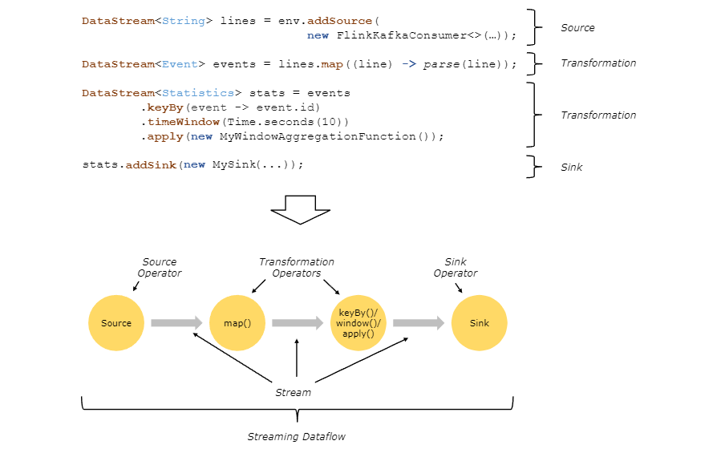

# Apache Flink

## 1. Overview

Apache Flink is a Big Data processing framework that allows programmers to process a vast amount of data in a very
efficient and scalable manner.

In this article, we’ll introduce some of the core API concepts and standard data transformations available in the Apache
Flink Java API. The fluent style of this API makes it easy to work with Flink’s central construct – the distributed
collection.

First, we will take a look at Flink’s DataSet API transformations and use them to implement a word count program. Then
we will take a brief look at Flink’s DataStream API, which allows you to process streams of events in a real-time
fashion.

