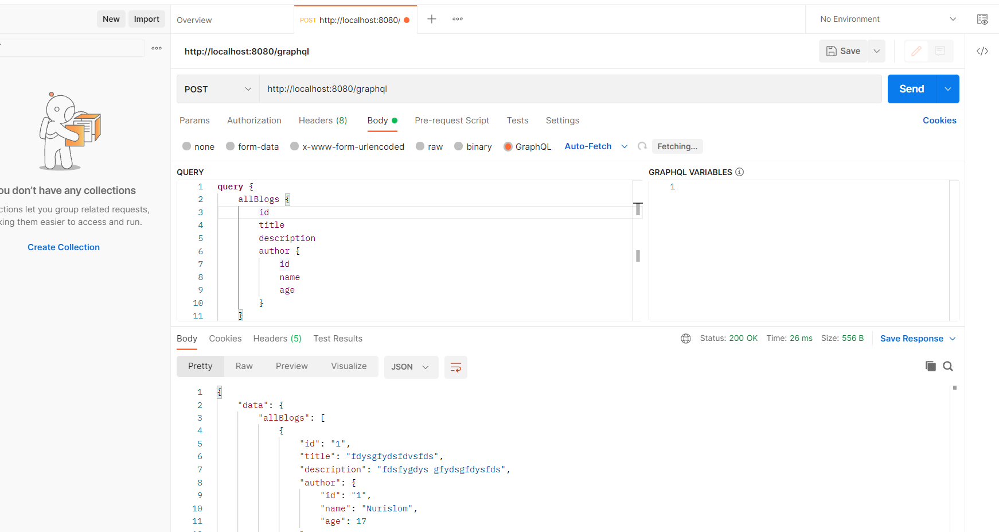
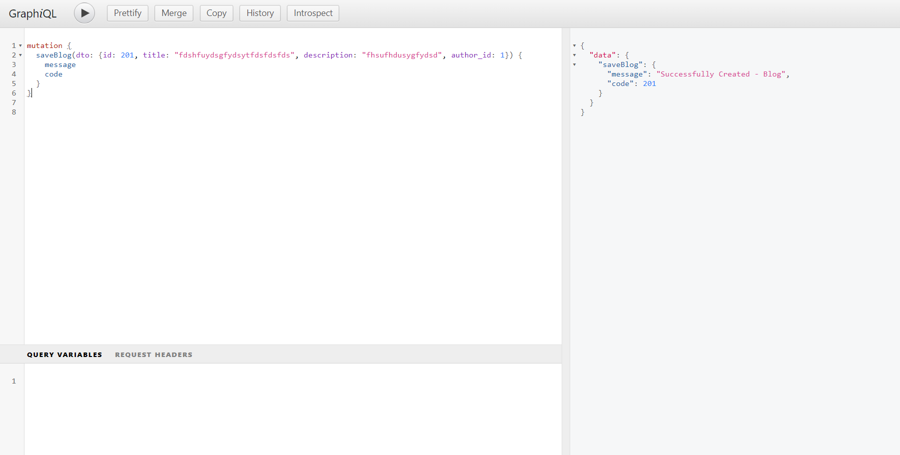

# UP AND RUNNING WITH SPRING BOOT FOR GRAPHQL

### WHY GRAPHQL
There are so many things to learn but your time is valuable and you need to spend it wisely. That said, don’t dive into something just because everyone else is talking about. Let’s discuss why you should spend some of that valuable time learning GraphQL.

If you’re currently building REST APIs you have probably come across this scenario. The API might have started out for a single purpose like feeding data to your frontend client for the web. Even if you stay right there this application might of evolved over time and may have even split into micro frontends. As this application grows you are constantly getting requests for new endpoints that return the data in a specific shape.

The next evolution of this API is when more and more clients have requirements for data. You might have 3rd party services, internal microservices, mobile applications and IoT applications all with their own specific data requirements.

Each of these clients have specific limitations and data requirements. The web application for this application has a ton of real estate on the screen so it can request a lot of data and display it to the user. The web client also doesn’t have to think about constraints like battery life or connection speeds.

When you move to a mobile application you do have to think about things like screen size, battery life and connection speeds. Because of those constraints you might have setup new endpoints for your mobile applications to return smaller data sets.

This is where GraphQL really stands out and provides a solution to a real problem. GraphQL has a single endpoint and lets each individual client request exactly what data they need. Gone are the days of standup up new endpoints each time a new requirement is raised.

```Graphql
query {
  allBooks {
    title
    pages
    rating {
      star
    }
    author {
      firstName
      lastName
    }
  }
}
```

### WHAT IS GRAPHQL
Now that you understand why you would reach for GraphQL let’s talk about some of the fundamentals of it. First off GraphQL is a query language for your API, and a server-side runtime for executing queries using a type system you define for your data. It is an alternative to REST & SOAP and in most cases will replace those, not sit alongside them.

GraphQL isn't tied to any specific database or storage engine and is instead backed by your existing code and data. This is an important concept to understand so we should start there.

In your existing applications your REST API is also not tied to any specific database. In your Rest Controller endpoints you accept the arguments you need and in turn delegate to a service or repository for the data. GraphQL is no different so if you’re asking questions like “How does GraphQL connect to my database” you’re asking the wrong ones.

GraphQL was created back in 2012 by Facebook. They were facing a lot of the same problems we discussed in the previous section. They had these massive amounts of data sets and mobile was becoming the dominant way users were accessing their application.

GraphQL was open sourced back in 2015 and is now governed by a neutral foundation made up of some really great companies. You will find implementations of the GraphQL Spec in almost every language. This means that after you learn it on the Java side you should be able to move over to JavaScript and hit the ground running.



### Mutation Save Blog


### http://localhost:8080/graphiql

default console graphql