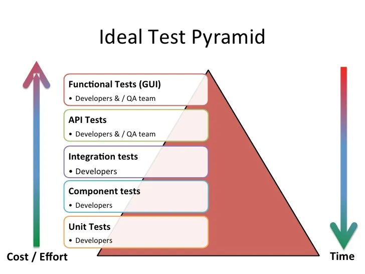
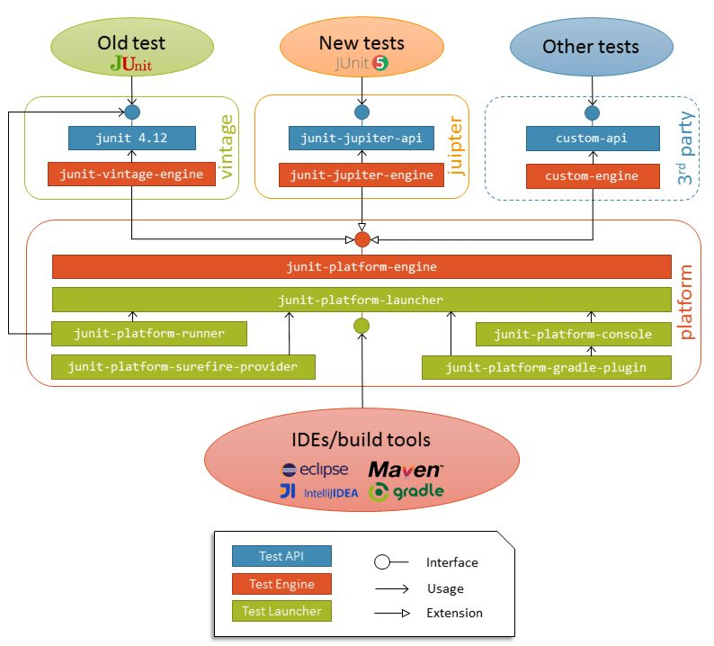

# Junit 5

## What is JUnit 5 ?

Unlike previous versions of JUnit, JUnit 5 is composed of several different modules from three different sub-projects.

JUnit 5 = JUnit Platform + JUnit Jupiter + JUnit Vintage

**JUnit Platform** serves as a foundation for launching testing frameworks on the JVM. It also defines the TestEngine
API for developing a testing framework that runs on the platform. Furthermore, the platform provides a Console Launcher
to launch the platform from the command line and the JUnit Platform Suite Engine for running a custom test suite using
one or more test engines on the platform. First-class support for the JUnit Platform also exists in popular IDEs (see
IntelliJ IDEA, Eclipse, NetBeans, and Visual Studio Code) and build tools (see Gradle, Maven, and Ant).

**JUnit Jupiter** is the combination of the programming model and extension model for writing tests and extensions in
JUnit
5 . The Jupiter sub-project provides a TestEngine for running Jupiter based tests on the platform.

**JUnit Vintage** provides a TestEngine for running JUnit 3 and JUnit 4 based tests on the platform. It requires JUnit
4.12
or later to be present on the class path or module path.

---

JUnit Javada test yozish uchun ommabop va open-source framework. JUnit 5 uni so'nggi versiyasi. JUnit 5 2017 yil sentabr
oyida chiqarilgan va o'zidan oldingi JUnit 4 ga nisbatan bir qancha yangi xususiyatlar va yaxshilanishlarni taqdim
etadi. JUnit platformasi JVM da test tizimlarni ishga tushirish uchun asos bo'lib xizmat qiladi.

Unit Testlar kichik kod qismni o'zi mo'ljallangan narsani bajarayotgani tekshirish uchun yoziladi. Unit Testlar ilova 
kodi tashqi bog'liqliklar bilan to'g'ri ishlayotgani tekshirmaydi. U bitta componentga e'tibor qaratadi va ushbu 
component to'g'ri natija beradi yoqmi shuni tekshiradi. Yani method kutilgan harakatni qilishni tekshiradi. Testlar odatda
unitga ma'lumotlarni taqdim etadi va unit tomonidan ishlab chiqarilgan natijalar yoki effectlarni kutilgan natijalar
bilan taqqoslab baholaydi.

Unit Testlar odatda individual funksiya, method va classni ifodalaydi va uning xatti harakatlarini alohida alohida sinab
ko'rishga qaratilgan.




## Supported Java Versions

JUnit 5 requires Java 8 (or higher) at runtime. However, you can still test code that has been compiled with previous
versions of the JDK.

## Dependencies

1. JUnit Platform
    * **Group ID**: `org.junit.platform`
    * **Version**: `1.9.3`
2. JUnit Jupiter
    * **Group ID**: `org.junit.jupiter`
    * **Version**: `5.9.3`
3. JUnit Vintage
    * **Group ID**: `org.junit.vintage`
    * **Version**: `5.9.3`

## JUnit Architecture



# Why do we need to write unit tests?

Unit tests are essential for several reasons:

1. Error Detection: Unit tests help identify bugs and errors in code by validating individual units or components of a 
   software system. They allow developers to catch and fix issues early in the development process, reducing the 
   likelihood of those issues propagating to other parts of the codebase.

2. Code Quality: Writing unit tests often leads to better code quality. It encourages modular and loosely coupled code 
   design, as tests typically focus on isolated units of code. This promotes good programming practices such as 
   separation of concerns and improves code maintainability and readability.

3. Regression Prevention: Unit tests act as a safety net during software development. They can automatically check 
   existing functionality whenever code changes are made, preventing regressions. By re-running tests frequently, 
   developers can catch unintended side effects and ensure that new changes do not break previously working code.

4. Documentation: Unit tests serve as living documentation for code behavior. They provide examples and usage scenarios 
   for how components should be used, making it easier for developers to understand how to interact with them correctly.

5. Collaboration and Refactoring: Unit tests facilitate collaboration among developers. When multiple people are working
   on a project, unit tests provide a shared understanding of code behavior and serve as a communication tool. 
   Furthermore, having a comprehensive test suite gives developers confidence to refactor or modify existing code, 
   knowing that tests will catch potential regressions.

6. Continuous Integration and Deployment: Unit tests are a crucial part of automated testing pipelines. They enable 
   continuous integration and deployment workflows by validating code changes before they are merged into the main 
   codebase. This ensures that new code is stable and minimizes the risk of introducing bugs into production.

7. Overall, unit tests contribute to software reliability, maintainability, and developer productivity, making them an 
   essential practice in modern software development.

--- 

1. Error Detection: Unit Test yozishni afzalliklaridan biri dasturiy ta'minot tizimning alohida unitlari va 
   componentlarini tekshirish orqali koddagi xato va kamchiliklarni aniqlashga yordam beradi. Unit Test yozish 
   dasturchilarga muammolarni dasturni ishlab chiqish jarayonining boshida aniqlash va tuzatish imkoni beradi, bu
   muammolarning kodlari bazasning boshqa qismlariga tarqalish ehtimolni kamaytiradi.

2. Code Quality: Unit Testlarni yozish ko'pincha kod sifatini yaxshilashga yordam beradi. Bu Modular(Modulli) va Loose
   Coopled(Erkin bog'langan) kodlarni yozishga undaydi, chunki testlar odatda ajratilgan kod birliklariga qaratilgan
   
3. Regression Prevention: Unit Testlar dasturiy ta'minotni ishlab chiqishda xavfsizlik tarmog'i vazifasini bajaradi.
   Kod o'zgartirilganda ular avtomatik ravishda mavjud funksiyalarni tekshirib, regressiyani oldini oladi. Testlarni
   tez-tez qayta o'tkazish orqali ishlab chiquvchilar kutilmagan nojo'ya ta'sirlarni qo'lga kiritishlari va yangi 
   o'zgarishlarning ilgari ishlaydigan kodni buzmasligiga ishonch hosil qilishlari mumkin. 

4. Documentation: Unit Testlar kod harakatni jonli hujjat sifatida xizmat qiladi. Ular componentlardam qanday foydalanish
   kerakligi haqida misollar va foydalanish stsenariylarini taqdim etadi, bu esa ishlab chiquvchilarga ular bilan
   qanday to'g'ri munosabatda bo'lishni tushunishlari osonlashtiradi.

5. Collabration and Refactoring: Unit Testlar Developer o'rtasida hamkorlikni osonlashtiradi. Bir nechta odam loyiha
   ustida ishlayotgan bo'lsa, unit testlar kod xatti-harakatlarni umumiy tushinishni ta'minlaydi va aloqa vositasi 
   sifatida xizmat qiladi. Bundan tashqari, keng qamrovli test to'plamiga ega bo'lish developerlarga mavjud kodni
   qayta tiklash yoki o'zgartirishga ishonch beradi, chunki testlar potensial reggresiyalarni ushlaydi.

6. Continuous Integration and Deployment: Unit Testlar avtomatlashtirilgan sinov pipeline(quvur)larining muhim qismi.
   Ular asosiy kod bazasiga birlashtirilishidan oldin kod o'zgarishlarini tekshirish orqali continues integration va 
   deployment yani tarqatish ish oqimlarni faollashtiradi. Bu yangi kodni barqarorligini taminlaydi va ishlab chiqishda
   xatoliklar xavfni kamaytiradi.

 
#  Writing Tests

The following example provides a glimpse at the minimum requirements for writing a test in JUnit Jupiter.

```java
@Test
void simpleTest() {
    CalculateService service = new CalculateService();
    long calculate = service.calculate(5, 5, '+');
    Assertions.assertEquals(10, calculate);
}
```

## 2.1 Annotations

JUnit Jupiter supports the following annotations for configuring tests and extending the framework.

Unless otherwise stated, all core annotations are located in the `org.junit.jupiter.api` package in the
`junit-jupiter-api` module.

---

JUnit Jupiter testlarni sozlash uchun quyidagi annotation-larni qo'llab-quvvatlaydi.

<table>
   <tr>
      <th>Annotation</th>
      <th>Description</th>
   </tr>
   <tr>
      <td>@Test</td>
      <td>Denotes that a method is a test method. Unlike JUnit 4’s `@Test` annotation, this annotation does not declare 
         any attributes, since test extensions in JUnit Jupiter operate based on their own dedicated annotations. 
         Such methods are inherited unless they are overridden.</td>
   </tr>
   <tr>
      <td>@ParameterizedTest</td>
      <td>Denotes that a method is a parameterized test. Such methods are inherited unless they are overridden.</td>
   </tr>
   <tr>
      <td>@RepeatedTest</td>
      <td>Denotes that a method is a test template for a repeated test. Such methods are inherited unless they are 
         overridden.</td>
   </tr>
   <tr>
      <td>@TestFactory</td>
      <td>Denotes that a method is a test factory for dynamic tests. Such methods are inherited unless they are 
         overridden.</td>
   </tr>
   <tr>
      <td>@TestTemplate</td>
      <td>Denotes that a method is a template for test cases designed to be invoked multiple times depending on the 
         number of invocation contexts returned by the registered providers. Such methods are inherited unless they are 
         overridden.</td>
   </tr>
   <tr>
      <td>@TestClassOrder</td>
      <td>Used to configure the test class execution order for @Nested test classes in the annotated test class. Such 
         annotations are inherited.</td>
   </tr>
   <tr>
      <td>@TestMethodOrder</td>
      <td>Used to configure the test method execution order for the annotated test class; similar to JUnit 4’s 
         `@FixMethodOrder`. Such annotations are inherited.</td>
   </tr>
   <tr>
      <td>@TestInstance</td>
      <td>Used to configure the test instance lifecycle for the annotated test class. Such annotations are inherited.</td>
   </tr>
   <tr>
      <td>@DisplayName</td>
      <td>Declares a custom display name for the test class or test method. Such annotations are not inherited.</td>
   </tr>
   <tr>
      <td>@DisplayNameGeneration</td>
      <td>Declares a custom display name generator for the test class. Such annotations are inherited.</td>
   </tr>
   <tr>
      <td>@BeforeEach</td>
      <td>Denotes that the annotated method should be executed before each @Test, @RepeatedTest, @ParameterizedTest, or 
         @TestFactory method in the current class; analogous to JUnit 4’s @Before. Such methods are inherited – unless 
         they are overridden or superseded (i.e., replaced based on signature only, irrespective of Java’s visibility 
         rules).</td>
   </tr>
   <tr>
      <td>@AfterEach</td>
      <td>Denotes that the annotated method should be executed after each @Test, @RepeatedTest, @ParameterizedTest, or 
         @TestFactory method in the current class; analogous to JUnit 4’s @After. Such methods are inherited – unless 
         they are overridden or superseded (i.e., replaced based on signature only, irrespective of Java’s visibility 
         rules).</td>
   </tr>
   <tr>
      <td>@BeforeAll</td>
      <td>Denotes that the annotated method should be executed before all @Test, @RepeatedTest, @ParameterizedTest, and 
         @TestFactory methods in the current class; analogous to JUnit 4’s @BeforeClass. Such methods are inherited – 
         unless they are hidden, overridden, or superseded, (i.e., replaced based on signature only, irrespective of 
         Java’s visibility rules) – and must be static unless the "per-class" test instance lifecycle is used.</td>
   </tr>
   <tr>
      <td>@AfterAll</td>
      <td>Denotes that the annotated method should be executed after all @Test, @RepeatedTest, @ParameterizedTest, and 
         @TestFactory methods in the current class; analogous to JUnit 4’s @AfterClass. Such methods are inherited – 
         unless they are hidden, overridden, or superseded, (i.e., replaced based on signature only, irrespective of 
         Java’s visibility rules) – and must be static unless the "per-class" test instance lifecycle is used.</td>
   </tr>
   <tr>
      <td>@DisplayNameGeneration</td>
      <td>Declares a custom display name generator for the test class. Such annotations are inherited.</td>
   </tr>
   <tr>
      <td>@DisplayNameGeneration</td>
      <td>Declares a custom display name generator for the test class. Such annotations are inherited.</td>
   </tr>
   <tr>
      <td>@Nested</td>
      <td>Denotes that the annotated class is a non-static nested test class. On Java 8 through Java 15, @BeforeAll and 
         @AfterAll methods cannot be used directly in a @Nested test class unless the "per-class" test instance 
         lifecycle is used. Beginning with Java 16, @BeforeAll and @AfterAll methods can be declared as static in a 
         @Nested test class with either test instance lifecycle mode. Such annotations are not inherited.</td>
   </tr>
   <tr>
      <td>@Tag</td>
      <td>Used to declare tags for filtering tests, either at the class or method level; analogous to test groups in 
         TestNG or Categories in JUnit 4. Such annotations are inherited at the class level but not at the method level.</td>
   </tr>
   <tr>
      <td>@Disabled</td>
      <td>Used to disable a test class or test method; analogous to JUnit 4’s @Ignore. Such annotations are not inherited.</td>
   </tr>
   <tr>
      <td>@Timeout</td>
      <td>Used to fail a test, test factory, test template, or lifecycle method if its execution exceeds a given 
         duration. Such annotations are inherited.</td>
   </tr>
   <tr>
      <td>@ExtendWith</td>
      <td>Used to register extensions declaratively. Such annotations are inherited.</td>
   </tr>
   <tr>
      <td>@RegisterExtension</td>
      <td>Used to register extensions programmatically via fields. Such fields are inherited unless they are shadowed.</td>
   </tr>
   <tr>
      <td>@TempDir</td>
      <td>Used to supply a temporary directory via field injection or parameter injection in a lifecycle method or test 
         method; located in the `org.junit.jupiter.api.io` package.</td>
   </tr>
</table>

# Jupiter Concepts

**Lifecycle Method**

- any method that is directly annotated or meta-annotated with `@BeforeAll`, `@AfterAll`, `@BeforeEach`,
  or `@AfterEach`.

**Test Class**

- any top-level class, static member class, or @Nested class that contains at least one test method, i.e. a container.
  Test classes must not be abstract and must have a single constructor.

**Test Method**

- any instance method that is directly annotated or meta-annotated with `@Test`, `@RepeatedTest`, `@ParameterizedTest`,
  `@TestFactory`, or `@TestTemplate`. With the exception of @Test, these create a container in the test tree that groups
  tests or, potentially (for @TestFactory), other containers.

--- 

**Lifecycle Method**

- `@BeforeAll`, `@AfterAll`, `@BeforeEach`, or `@AfterEach`. Ushbu 4ta annotatsiyadan istalgan biri qoyilgan method
  _Lifecycle Method_ deyiladi. Yani Test Classlar bajarilishidan oldin yoki keyin ishlaydigan methodlar.

**Test Class**

- Har qanday top-level class, static member class yoki @Nested annotatsiyasi qoyilgan class. Ushbu classlarni ichida
  kamida bitta test method bo'lsa ushbu class _Test Class_ deb ataladi. Test Classlarni nomi **Test** bilan tugashi
  majburiy emas. Lekin test class ekanligini bildirish uchun test qo'shimchasini qo'shimiz kerak.

**Test Method**

- `@Test`, `@RepeatedTest`, `@ParameterizedTest`, `@TestFactory` yoki `@TestTemplate` annotatsiyalaridan biri qoyilgan
  method test method deyiladi.

# Test Classes and Methods

Test methods and lifecycle methods may be declared locally within the current test class, inherited from superclasses,
or inherited from interfaces (see Test Interfaces and Default Methods). In addition, test methods and lifecycle methods
must not be `abstract` and must not return a value (except `@TestFactory` methods which are required to return a value).

---

Test Methodlar va Lifecycle Methodlar superclasslardan meros bo'lib o'tishi mumkin. Bundan tashqari test va lifecycle
methodlar `abstract` bo'lmasligi va qiymat qaytarmasligi kerak.

## Class and method visibility

Test classes, test methods, and lifecycle methods are not required to be public, but they must not be private.

---

Test Classlar, test methodlar va lifecycle methodlar `public` bo'lishi shart emas. `private` bo'lishi mumkin emas.

----

`It is generally recommended to omit the public modifier for test classes, test methods, and lifecycle methods unless
there is a technical reason for doing so – for example, when a test class is extended by a test class in another
package. Another technical reason for making classes and methods public is to simplify testing on the module path when
using the Java Module System.`

```java
public class LifecycleMethodTests {

    private static final Logger log = LoggerFactory.getLogger(LifecycleMethodTests.class);

    @BeforeAll
    static void initAll() {
        log.info("initAll Method Start");
    }

    @BeforeEach
    void init() {
        log.info("init Method Start");
    }

    @Test
    void failingTest() {
        log.error("failingTest Method Start");
    }

    @Test
    @Disabled("for demonstration purposes")
    void skippedTest() {
        // not executed!
    }

    @Test
    void abortedTest() {
        log.info("test should have been aborted");
    }

    @AfterEach
    void tearDown() {
        log.warn("tearDown Method Start");
    }

    @AfterAll
    static void tearDownAll() {
        log.warn("tearDownAll Method Start");
    }

}
```

# Display Names

Test classes and test methods can declare custom display names via @DisplayName — with spaces, special characters,
and even emojis — that will be displayed in test reports and by test runners and IDEs.

---

`@DisplayName` annotatsiyasi bilan test class va methodlariga nom berishimiz mumkin. Har xil turdagi belgi va emojilar
foydalanib nom berishimiz ham mumkin.

```java
@DisplayName("Display Name Test Class")
public class DisplayNameTest {

    @Test
    @DisplayName("Custom test name containing spaces")
    void testWithDisplayNameContainingSpaces() {
    }

    @Test
    @DisplayName("╯°□°）╯")
    void testWithDisplayNameContainingSpecialCharacters() {
    }

    @Test
    @DisplayName("😱")
    void testWithDisplayNameContainingEmoji() {
    }

}
```

# Assertions

We use assertions in unit tests to verify that certain conditions or expectations are true. They serve as checkpoints to
ensure that the code behaves as intended during testing. If an assertion fails, it indicates a deviation from the 
expected behavior, helping identify bugs or errors in the code. Assertions help maintain code correctness and provide 
feedback on the test results.

--- 

Shartlar va taxminlarning to'g'riligini tekshirish uchun biz unit testlarda assertionlardan foydalanamiz. Ular test 
paytida kodning o'zini qanday tutishini ta'minlash uchun nazorat punktlari bo'lib xizmat qiladi. 

```java
public class AssertionsExampleTest {

    private final CalculateService service = new CalculateService();
    private final Person person = new Person("Nurislom", 18);

    @Test
    void standardAssertions() {
        assertEquals(4, service.calculate(2, 2, '+'));
        assertEquals(5, service.calculate(10, 5, '-'));
        assertTrue('a' < 'b', "Assertion messages can be lazily evaluated -- " +
                "to avoid constructing complex messages unnecessarily.");
    }

    @Test
    void groupedAssertions() {
        // In a grouped assertion all assertions are executed, and all failures will be reported together.
        assertAll(
                () -> assertEquals("Nurislom", person.getName()),
                () -> assertEquals(18, person.getAge()),
                () -> assertEquals(5, 5)
        );
    }

    @Test
    void dependentAssertions() {
        // Within a code block, if an assertion fails the subsequent code in the same block will be skipped.
        assertAll(
                () -> {
                    String name = person.getName();
                    assertNotNull(name);

                    // Executed only if the previous assertion is valid.
                    assertAll(name,
                            () -> assertTrue(name.startsWith("N")),
                            () -> assertTrue(name.endsWith("m"))
                    );
                },
                () -> {
                    Integer age = person.getAge();
                    assertNotNull(age);

                    // Executed only if the previous assertion is valid.
                    assertAll(String.valueOf(age),
                            () -> assertEquals(18, (int) age),
                            () -> assertTrue(true)
                    );
                }
        );
    }

    @Test
    void exceptionTesting() {
        ArithmeticException exception = assertThrows(ArithmeticException.class,
                () -> service.calculate(1L, 0L, '/'));
        assertEquals("cannot be divided by zero.", exception.getMessage());
    }

    @Test
    void timeoutNotExceeded() {
        // The following assertion succeeds.
        assertTimeout(Duration.ofSeconds(5), () -> {
            // Perform task that takes less than 5 seconds.
            System.out.println("Nurislom");
        });
    }

    @Test
    void timeoutNotExceededWithResult() {
        // The following assertion succeeds, and returns the supplied object.
        String result = assertTimeout(Duration.ofSeconds(3), () -> "Abdulloh");
        assertEquals("Abdulloh", result);
    }

    @Test
    void timeoutNotExceededWithMethod() {
        // The following assertion invokes a method reference and returns an object.
        String greeting = assertTimeout(Duration.ofSeconds(3), service::greeting);
        assertEquals("Boom", greeting);
    }

    @Test
    void timeoutExceeded() {
        // The following assertion fails with an error message similar to:
        // execution exceeded timeout of 10 ms by 91 ms
        assertTimeout(Duration.ofMillis(10), () -> {
            // Simulate task that takes more than 10 ms.
            Thread.sleep(100);
        }, () -> "Hello World");
    }

    @Test
    void timeoutExceededWithAssertion() {
        assertAll(() -> {
            assertThrows(AssertionFailedError.class, () -> {
                assertTimeout(Duration.ofMillis(10), () -> {
                    Thread.sleep(20);
                    return new RuntimeException("Not Executed!");
                }, () -> "Not Executed!");
            });
        });
    }

    @Test
    void timeoutExceededWithPreemptiveTermination() {
        // The following assertion fails with an error message similar to:
        // execution timed out after 10 ms
        assertTimeoutPreemptively(Duration.ofMillis(10), () -> {
            // Simulate task that takes more than 10 ms.
            new CountDownLatch(1).await();
        });
    }

}
```

# Third-party Assertion Libraries

Even though the assertion facilities provided by JUnit Jupiter are sufficient for many testing scenarios, there are
times when more power and additional functionality such as matchers are desired or required. In such cases, the JUnit
team recommends the use of third-party assertion libraries such
as [AssertJ](https://joel-costigliola.github.io/assertj/),
[Hamcrest](https://hamcrest.org/JavaHamcrest/), [Truth](https://truth.dev/), etc. Developers are therefore free to use
the assertion library of their choice.

# Disabling Tests

```java
@Disabled("Disabled until bug #99 has been fixed")
class DisabledClassDemo {

    @Test
    void testWillBeSkipped() {
    }

}
```

# Conditional Test Execution

The ExecutionCondition extension API in JUnit Jupiter allows developers to either enable or disable a container or test
based on certain conditions programmatically. The simplest example of such a condition is the built-in DisabledCondition
which supports the @Disabled annotation (see Disabling Tests). In addition to @Disabled, JUnit Jupiter also supports
several other annotation-based conditions in the org.junit.jupiter.api.condition package that allow developers to enable
or disable containers and tests declaratively. When multiple ExecutionCondition extensions are registered, a container
or test is disabled as soon as one of the conditions returns disabled. If you wish to provide details about why they
might be disabled, every annotation associated with these built-in conditions has a disabledReason attribute available
for that purpose.

---

ExecutionCondition API dasturchilarga container yoki testni yoqish yoki o'chirish imkoni beradi.

## Custom Conditions

As an alternative to implementing an `ExecutionCondition`, a container or test may be enabled or disabled based on a
condition method configured via the `@EnabledIf` and `@DisabledIf` annotations. A condition method must have a boolean
return type and may accept either no arguments or a single ExtensionContext argument.

---

Unit Testlarda `Execution Condition` ni amalga oshirish uchun `@EnabledIf` va `@DisabledIf` annotatsiyalaridan 
foydalanish mumkin. 

```java
@Test
@EnabledIf("customCondition")
void enabled() {
    // ...
}

@Test
@DisabledIf("customCondition")
void disabled() {
    // ...
}

boolean customCondition() {
    return true;
}
```

Alternatively, the condition method can be located outside the test class. In this case, it must be referenced by its
fully qualified name as demonstrated in the following example.

```java
package example;

import org.junit.jupiter.api.Test;
import org.junit.jupiter.api.condition.EnabledIf;

class ExternalCustomConditionDemo {

    @Test
    @EnabledIf("example.ExternalCondition#customCondition")
    void enabled() {
        // ...
    }

}

class ExternalCondition {

    static boolean customCondition() {
        return true;
    }

}
```

# Nested Tests

`@Nested` tests give the test writer more capabilities to express the relationship among several groups of tests. Such
nested tests make use of Java’s nested classes and facilitate hierarchical thinking about the test structure. Here’s an
elaborate example, both as source code and as a screenshot of the execution within an IDE.

Only non-static nested classes (i.e. inner classes) can serve as @Nested test classes. Nesting can be arbitrarily deep,
and those inner classes are subject to full lifecycle support with one exception: @BeforeAll and @AfterAll methods do
not work by default. The reason is that Java does not allow static members in inner classes prior to Java 16. However,
this restriction can be circumvented by annotating a @Nested test class with @TestInstance(Lifecycle.PER_CLASS)
(see Test Instance Lifecycle). If you are using Java 16 or higher, @BeforeAll and @AfterAll methods can be declared as
static in @Nested test classes, and this restriction no longer applies.

---

JUnit 5da `@Nested` annotatsiyasi inner test classlarni yaratish uchun ishlatiladi.

Static bo'lmagan classlargina inner test class bo'lishi mumkin. default holatda static `@BeforeAll` va `@AfterAll`
lifecycle methodlari ishlamaydi. Sababi Java 16 dan oldin inner classlarda static memberlarga ruhsat berilmaydi.
Ammo ushbu cheklov 16dan boshlab `@TestIntance(Lifecycle.PER_CLASS)` annotatsiyasini `@Nested` annotatsiyasi qo'yilgan
inner classga qo'yish orqali chetlab o'tish mumkin.

```java

@DisplayName("List Interface Several Case Tests")
public class ListInterfaceTest {

    List<Integer> nums;

    @Test
    void initialize() {
        nums = new ArrayList<>();
    }

    @Nested
    @DisplayName("When Is New")
    class WhenIsNew {

        @BeforeEach
        void beforeEach() {
            nums = new ArrayList<>();
        }

        @Test
        void isNonNullTest() {
            assertFalse(Objects.isNull(nums));
        }

        @Test
        void isEmptyTest() {
            assertTrue(nums.isEmpty());
        }

        @Test
        void throwsRuntimeException() {
            assertThrows(RuntimeException.class, () -> nums.get(0));
        }

        @Test
        void throwsArrayIndexOutOfBound() {
            assertThrows(IndexOutOfBoundsException.class, () -> nums.get(9));
        }

        @Nested
        @DisplayName("After Pushing Element Several Test Cases")
        class AfterPushingElementTest {

            @BeforeEach
            void beforeEach() {
                nums.add(18);
            }

            @Test
            void isNotEmpty() {
                assertFalse(nums.isEmpty());
            }

            @Test
            void listElementEqualsTest() {
                assertEquals(18, nums.get(0));
            }

        }

    }

}
```

# @RepeatedTest

JUnit Jupiter provides the ability to repeat a test a specified number of times by annotating a method with
@RepeatedTest and specifying the total number of repetitions desired. Each invocation of a repeated test behaves like
the execution of a regular @Test method with full support for the same lifecycle callbacks and extensions.

In addition to specifying the number of repetitions, a custom display name can be configured for each repetition via the
name attribute of the @RepeatedTest annotation. Furthermore, the display name can be a pattern composed of a combination
of static text and dynamic placeholders. The following placeholders are currently supported.

- `{displayName}`: display name of the `@RepeatedTest` method
- `{currentRepetition}`: the current repetition count
- `{totalRepetitions}`: the total number of repetitions

---

JUnit Testni `@RepeatedTest` bilan methodga annotatsiya qo'yish va kerakli takrorlashlarning umumiy sonini belgilash
orqali ma'lum bir necha marta takrorlash imkoniyatini beradi. Repeated Testning har bir chaqiruvi `@Test` methodning
bajarilishi kabi ishlaydi.

```java
@RepeatedTest(10)
void repeatedTest(){ 
    // ...
}
```

```java
class RepeatedTestsDemo {

    private Logger logger = // ...

    @BeforeEach
    void beforeEach(TestInfo testInfo, RepetitionInfo repetitionInfo) {
        int currentRepetition = repetitionInfo.getCurrentRepetition();
        int totalRepetitions = repetitionInfo.getTotalRepetitions();
        String methodName = testInfo.getTestMethod().get().getName();
        logger.info(String.format("About to execute repetition %d of %d for %s", //
            currentRepetition, totalRepetitions, methodName));
    }

    @RepeatedTest(10)
    void repeatedTest() {
        // ...
    }

    @RepeatedTest(5)
    void repeatedTestWithRepetitionInfo(RepetitionInfo repetitionInfo) {
        assertEquals(5, repetitionInfo.getTotalRepetitions());
    }

    @RepeatedTest(value = 1, name = "{displayName} {currentRepetition}/{totalRepetitions}")
    @DisplayName("Repeat!")
    void customDisplayName(TestInfo testInfo) {
        assertEquals("Repeat! 1/1", testInfo.getDisplayName());
    }

    @RepeatedTest(value = 1, name = RepeatedTest.LONG_DISPLAY_NAME)
    @DisplayName("Details...")
    void customDisplayNameWithLongPattern(TestInfo testInfo) {
        assertEquals("Details... :: repetition 1 of 1", testInfo.getDisplayName());
    }

    @RepeatedTest(value = 5, name = "Wiederholung {currentRepetition} von {totalRepetitions}")
    void repeatedTestInGerman() {
        // ...
    }

}
```


# Parameterized Tests

Parameterized tests make it possible to run a test multiple times with different arguments. They are declared just like
regular `@Test` methods but use the `@ParameterizedTest` annotation instead. In addition, you must declare at least one
source that will provide the arguments for each invocation and then consume the arguments in the test method.

The following example demonstrates a parameterized test that uses the `@ValueSource` annotation to specify a String
array
as the source of arguments.

---

Parameterized Testlar testni turli argumentlar bilan bir necha marta testdan o'tkazish imkoni beradi. Ular ham oddiy
testlar kabi e'lon qilinadi, lekin `@Test` annotatsiyasini o'rniga `@ParameterizedTest` annotatsiya qoyiladi va kirib
keluvchi parameterlarni e'lon qilishingiz kerak bo'ladi.

```java
@ParameterizedTest
@ValueSource(strings = {"racecar", "radar", "able was I ere I saw elba"})
void palindromes(String candidate) {
    assertTrue(StringUtils.isPalindrome(candidate));
}
```

## Required Setup

In order to use parameterized tests you need to add a dependency on the `junit-jupiter-params` artifact. Please refer to
Dependency Metadata for details.

## @ValueSource

`@ValueSource` is one of the simplest possible sources. It lets you specify a single array of literal values and can
only
be used for providing a single argument per parameterized test invocation.

The following types of literal values are supported by `@ValueSource`.

* short
* byte
* int
* long
* float
* double
* char
* boolean
* java.lang.String
* java.lang.Class

```java
@ParameterizedTest
@ValueSource(ints = { 1, 2, 3 })
void testWithValueSource(int argument) {
    assertTrue(argument > 0 && argument < 4);
}
```

## Null and Empty Sources

In order to check corner cases and verify proper behavior of our software when it is supplied bad input, it can be
useful to have null and empty values supplied to our parameterized tests. The following annotations serve as sources
of null and empty values for parameterized tests that accept a single argument.

- `@NullSource`: provides a single null argument to the annotated `@ParameterizedTest` method.
- `@EmptySource`: provides a single empty argument to the annotated `@ParameterizedTest` method for parameters of the
  following types: java.lang.String, java.util.List, java.util.Set, java.util.Map, primitive arrays (e.g., int[],
  char[][], etc.), object arrays (e.g.,String[], Integer[][], etc.).
- `@NullAndEmptySource`: a composed annotation that combines the functionality of `@NullSource` and `@EmptySource`.

```java
@ParameterizedTest
@NullSource
@EmptySource
@ValueSource(strings = {" ", "   ", "\t", "\n"})
void nullEmptyAndBlankStrings(String text) {
    assertTrue(text == null || text.trim().isEmpty());
}
```

```java
@ParameterizedTest
@NullAndEmptySource
@ValueSource(strings = {" ", "   ", "\t", "\n"})
void nullEmptyAndBlankStrings(String text) {
    assertTrue(text == null || text.trim().isEmpty());
}
```

## @EnumSource

`@EnumSource` Enum Constantalaridan foydalanishning qulay usulni taqdim etadi.

```java
@ParameterizedTest
@EnumSource(ChronoUnit.class)
void testWithEnumSource(TemporalUnit unit) {
    assertNotNull(unit);
}
```

```java
@ParameterizedTest
@EnumSource
void testWithEnumSourceWithAutoDetection(ChronoUnit unit) {
    assertNotNull(unit);
}
```

`@EnumSource`ni names attributedan foydalanib faqat o'zimizga kerakli bo'lgan konstantalarni olishimiz ham mumkin.

```java
@ParameterizedTest
@EnumSource(names = { "DAYS", "HOURS" })
void testWithEnumSourceInclude(ChronoUnit unit) {
    assertTrue(EnumSet.of(ChronoUnit.DAYS, ChronoUnit.HOURS).contains(unit));
}
```


## @MethodSource

@MethodSource allows you to refer to one or more factory methods of the test class or external classes.

Factory methods within the test class must be static unless the test class is annotated with
@TestInstance(Lifecycle.PER_CLASS); whereas, factory methods in external classes must always be static.

Each factory method must generate a stream of arguments, and each set of arguments within the stream will be provided as
the physical arguments for individual invocations of the annotated @ParameterizedTest method. Generally speaking this
translates to a Stream of Arguments (i.e., Stream<Arguments>); however, the actual concrete return type can take on many
forms. In this context, a "stream" is anything that JUnit can reliably convert into a Stream, such as Stream,
DoubleStream, LongStream, IntStream, Collection, Iterator, Iterable, an array of objects, or an array of primitives.
The "arguments" within the stream can be supplied as an instance of Arguments, an array of objects (e.g., Object[]), or
a single value if the parameterized test method accepts a single argument.

If you only need a single parameter, you can return a Stream of instances of the parameter type as demonstrated in the
following example.

---

`@MethodSource` bizga test classning va tashqi classlarning bir yoki bir nechta factory methodlariga murojaat qilish
imkoni beradi. Har bir factory method argumentlarni oqimni yaratishi kerak va oqim ichidagi argumentlarning har bir 
to'plami `@ParameterizedTest` methodning individual chaqiruvlari uchun jismoniy argumentlar sifatida taqdim etiladi.

```java
@ParameterizedTest
@MethodSource("stringProvider")
void testWithExplicitLocalMethodSource(String argument) {
    assertNotNull(argument);
}

static Stream<String> stringProvider() {
    return Stream.of("apple","banana");
}
```

## @CsvSource

@CsvSource allows you to express argument lists as comma-separated values (i.e., CSV String literals). Each string
provided via the value attribute in @CsvSource represents a CSV record and results in one invocation of the 
parameterized test. The first record may optionally be used to supply CSV headers (see the Javadoc for the 
useHeadersInDisplayName attribute for details and an example).

```java
@ParameterizedTest
@CsvSource({
    "apple,         1",
    "banana,        2",
    "'lemon, lime', 0xF1",
    "strawberry,    700_000"
})
void testWithCsvSource(String fruit, int rank) {
    assertNotNull(fruit);
    assertNotEquals(0, rank);
}
```

The default delimiter is a comma (,), but you can use another character by setting the delimiter attribute. 
Alternatively, the delimiterString attribute allows you to use a String delimiter instead of a single character.
However, both delimiter attributes cannot be set simultaneously.

By default, @CsvSource uses a single quote (') as its quote character, but this can be changed via the quoteCharacter 
attribute. See the 'lemon, lime' value in the example above and in the table below. An empty, quoted value ('') results 
in an empty String unless the emptyValue attribute is set; whereas, an entirely empty value is interpreted as a null 
reference. By specifying one or more nullValues, a custom value can be interpreted as a null reference (see the NIL 
example in the table below). An ArgumentConversionException is thrown if the target type of a null reference is a 
primitive type.

## @CsvFileSource

@CsvFileSource lets you use comma-separated value (CSV) files from the classpath or the local file system. Each record 
from a CSV file results in one invocation of the parameterized test. The first record may optionally be used to supply 
CSV headers. You can instruct JUnit to ignore the headers via the numLinesToSkip attribute. If you would like for the 
headers to be used in the display names, you can set the useHeadersInDisplayName attribute to true. The examples below 
demonstrate the use of numLinesToSkip and useHeadersInDisplayName.

The default delimiter is a comma (,), but you can use another character by setting the delimiter attribute. 
Alternatively, the delimiterString attribute allows you to use a String delimiter instead of a single character. 
However, both delimiter attributes cannot be set simultaneously.

```java
@ParameterizedTest
@CsvFileSource(resources = "/two-column.csv", numLinesToSkip = 1)
void testWithCsvFileSourceFromClasspath(String country, int reference) {
    assertNotNull(country);
    assertNotEquals(0, reference);
}

@ParameterizedTest
@CsvFileSource(files = "src/test/resources/two-column.csv", numLinesToSkip = 1)
void testWithCsvFileSourceFromFile(String country, int reference) {
    assertNotNull(country);
    assertNotEquals(0, reference);
}

@ParameterizedTest(name = "[{index}] {arguments}")
@CsvFileSource(resources = "/two-column.csv", useHeadersInDisplayName = true)
void testWithCsvFileSourceAndHeaders(String country, int reference) {
    assertNotNull(country);
    assertNotEquals(0, reference);
}
```

## @ArgumentsProvider

@ArgumentsSource can be used to specify a custom, reusable ArgumentsProvider. Note that an implementation of 
ArgumentsProvider must be declared as either a top-level class or as a static nested class.

---

@ArgumentSource annotatsiyasi orqali biz qayta foydalanish mumkin bo'lgan ArgumentsProviderni belgilash uchun 
ishlatishimiz mumkin. ArgumentProvider `@ParameterizedTest` methodiga uzatiladigan argumentlar oqimni yani streamni 
ta'minlash uchun javobgardir.

```java
public class ArgumentSourceTest {

    @ParameterizedTest
    @ArgumentsSource(ArgumentSourceProvider.class)
    void testWithArgumentSource(String name) {
        assertNotNull(name);
    }

}
```
```java
public class ArgumentSourceProvider implements ArgumentsProvider {

    @Override
    public Stream<? extends Arguments> provideArguments(ExtensionContext extensionContext) throws Exception {
        return Stream.of("Nurislom", "khasanof").map(Arguments::of);
    }
}
```

# Argument Conversion

### Widening Conversion

JUnit Jupiter supports Widening Primitive Conversion for arguments supplied to a @ParameterizedTest. For example, a 
parameterized test annotated with @ValueSource(ints = { 1, 2, 3 }) can be declared to accept not only an argument of 
type int but also an argument of type long, float, or double.

### Implicit Conversion
To support use cases like @CsvSource, JUnit Jupiter provides a number of built-in implicit type converters. The 
conversion process depends on the declared type of each method parameter.

For example, if a @ParameterizedTest declares a parameter of type TimeUnit and the actual type supplied by the declared 
source is a String, the string will be automatically converted into the corresponding TimeUnit enum constant.

```java
@ParameterizedTest
@ValueSource(strings = "SECONDS")
void testWithImplicitArgumentConversion(ChronoUnit argument) {
    assertNotNull(argument.name());
}
```

### Fallback String-to-Object Conversion

JUnit Jupiter also provides a fallback mechanism for automatic conversion from a String to a given target type if the 
target type declares exactly one suitable factory method or a factory constructor as defined below.

- factory method: a non-private, static method declared in the target type that accepts a single String argument and 
  returns an instance of the target type. The name of the method can be arbitrary and need not follow any particular 
  convention.

- factory constructor: a non-private constructor in the target type that accepts a single String argument. Note that the
  target type must be declared as either a top-level class or as a static nested class.

```java
@ParameterizedTest
@ValueSource(strings = "42 Cats")
void testWithImplicitFallbackArgumentConversion(Book book) {
    assertEquals("42 Cats", book.getTitle());
}
```

```java
public class Book {

    private final String title;

    private Book(String title) {
        this.title = title;
    }

    public static Book fromTitle(String title) {
        return new Book(title);
    }

    public String getTitle() {
        return this.title;
    }
}
```

### Explicit Conversion
Instead of relying on implicit argument conversion you may explicitly specify an ArgumentConverter to use for a certain 
parameter using the @ConvertWith annotation like in the following example. Note that an implementation of 
ArgumentConverter must be declared as either a top-level class or as a static nested class.

```java
@ParameterizedTest
@ValueSource(strings = {"Hello", "Boom", "Lorem Ipsum"})
void testWithExplicitArgumentConversion(@ConvertWith(ToLengthArgumentConverter.class) Integer length) {
    assertNotNull(length);
}
```

```java
public class ToLengthArgumentConverter extends TypedArgumentConverter<String, Integer> {

    protected ToLengthArgumentConverter() {
        super(String.class, Integer.class);
    }

    @Override
    protected Integer convert(String source) {
        return (source != null ? source.length() : 0);
    }

}
```

Explicit argument converters are meant to be implemented by test and extension authors. Thus, junit-jupiter-params only 
provides a single explicit argument converter that may also serve as a reference implementation: 
JavaTimeArgumentConverter. It is used via the composed annotation JavaTimeConversionPattern.

```java
@ParameterizedTest
@ValueSource(strings = { "01.01.2017", "31.12.2017" })
void testWithExplicitJavaTimeConverter(
        @JavaTimeConversionPattern("dd.MM.yyyy") LocalDate argument) {

    assertEquals(2017, argument.getYear());
}
```

# Argument Aggregation

By default, each argument provided to a @ParameterizedTest method corresponds to a single method parameter. 
Consequently, argument sources which are expected to supply a large number of arguments can lead to large method 
signatures.

In such cases, an ArgumentsAccessor can be used instead of multiple parameters. Using this API, you can access the 
provided arguments through a single argument passed to your test method. In addition, type conversion is supported as 
discussed in Implicit Conversion.

---

default holatda `@ParameterizedTest` method belgilangan har bir argument bitta method parameteriga mos keladi. 
Shunday qilib, ko'p argumentlarni taqdim etadigan argument sourcelari katta method signaturelarga olib kelishi mumkin.

Bunday hollarda bir nechta parameter o'rniga `ArgumentAccessor`dan foydalanish mumkin. Ushbu API yordamida siz taqdim 
etilgan argumentlarni methodga bitta argument orqali kirishingiz mumkin. 

```java
@ParameterizedTest
@CsvSource({
    "Jane, Doe, F, 1990-05-20",
    "John, Doe, M, 1990-10-22"
})
void testWithArgumentsAccessor(ArgumentsAccessor arguments) {
    Person person = new Person(arguments.getString(0),
                               arguments.getString(1),
                               arguments.get(2, Gender.class),
                               arguments.get(3, LocalDate.class));

    if (person.getFirstName().equals("Jane")) {
        assertEquals(Gender.F, person.getGender());
    }
    else {
        assertEquals(Gender.M, person.getGender());
    }
    assertEquals("Doe", person.getLastName());
    assertEquals(1990, person.getDateOfBirth().getYear());
}
```

### Custom Aggregators
Apart from direct access to a @ParameterizedTest method’s arguments using an ArgumentsAccessor, JUnit Jupiter also 
supports the usage of custom, reusable aggregators.

To use a custom aggregator, implement the ArgumentsAggregator interface and register it via the @AggregateWith 
annotation on a compatible parameter in the @ParameterizedTest method. The result of the aggregation will then be 
provided as an argument for the corresponding parameter when the parameterized test is invoked. Note that an 
implementation of ArgumentsAggregator must be declared as either a top-level class or as a static nested class.

---

JUnit `ArgumentsAccessor` yordamida `@ParameterizedTest` methodning argumentlariga to'g'ridan to'g'ri kirishdan tashqari
maxsus qayta ishlatiladigan aggregatorlardan foydalanishni ham qo'llab quvvatlaydi.

```java
@ParameterizedTest
@CsvSource({
    "Jane, Doe, F, 1990-05-20",
    "John, Doe, M, 1990-10-22"
})
void testWithArgumentsAggregator(@AggregateWith(PersonAggregator.class) Person person) {
    // perform assertions against person
}
```

```java
public class PersonAggregator implements ArgumentsAggregator {
    @Override
    public Person aggregateArguments(ArgumentsAccessor arguments, ParameterContext context) {
        return new Person(arguments.getString(0),
                          arguments.getString(1),
                          arguments.get(2, Gender.class),
                          arguments.get(3, LocalDate.class));
    }
}
```