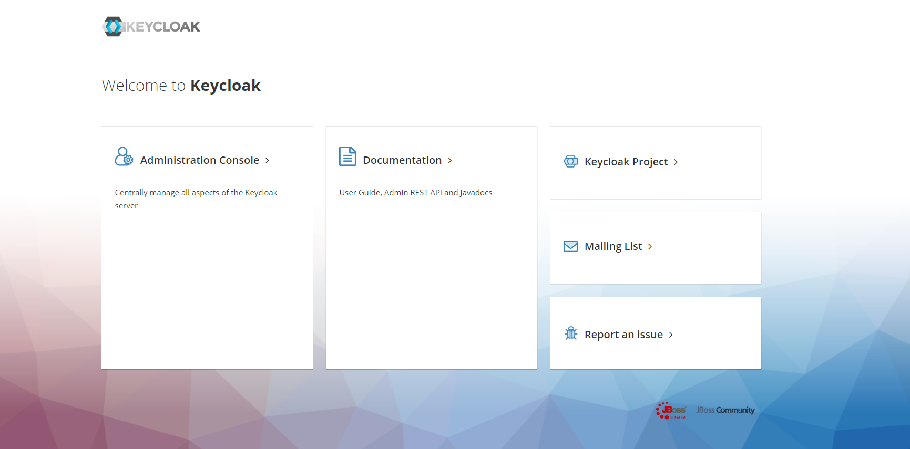
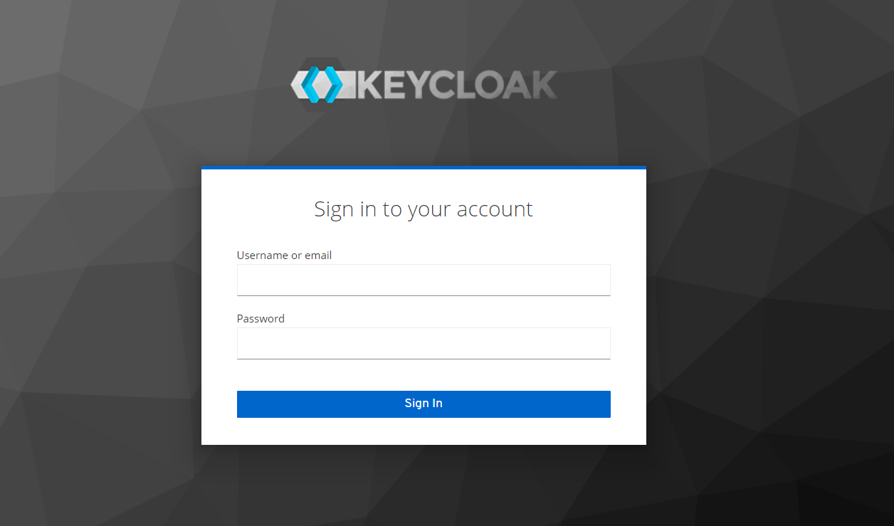
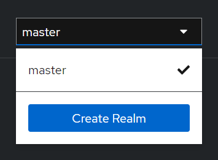

# Spring Boot 3.0.2 Integration Keycloak

## What Is Keycloak?
Keycloak is an open source Identity and Access Management solution targeted towards modern applications and services.

Keycloak offers features such as Single-Sign-On (SSO), Identity Brokering and Social Login, User Federation, Client Adapters, an Admin Console, and an Account Management Console.

In our tutorial, we'll use the Admin Console of Keycloak for setting up and connecting to Spring Boot using the Spring Security OAuth2.0.

## Downloading and Installing Keycloak

Let's download the [Keycloak-20.0.3 Standalone server](https://www.keycloak.org/archive/downloads-20.0.3.html) distribution from the official source.

Now let's open a browser and visit http://localhost:9080. We'll be redirected to http://localhost:9080/auth to create an administrative login:

we'll enter the initial admin user credentials: username - _admin_, password - _admin_

## Creating a Realm

A successful login will take us to the console and open up the default Master realm for us.

Let's **navigate to the upper left corner to discover the Create realm button:**

