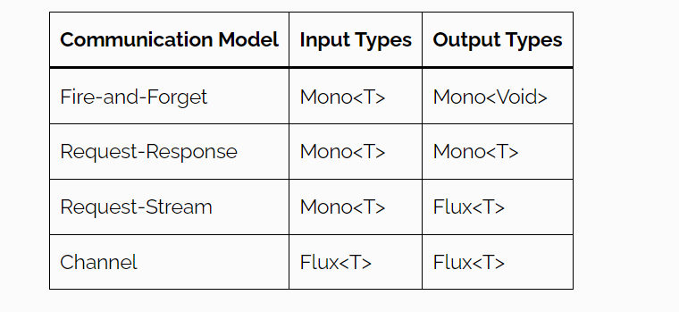

# RSocket

RSocket is a binary, point-to-point communication protocol intended for use in distributed applications. In that sense, 
it provides an alternative to other protocols like HTTP.

A full comparison between RSocket and other protocols is beyond the scope of this article. Instead, we'll focus on a key
feature of RSocket: its interaction models.

---

RSocket - bu distributed applicationlarda foydalanish uchun mo'ljallangan binary, point-to-point aloqa protocoli.
RSocker to'rtta o'zaro ta'sir modelini taqdim etadi.

RSocket request-response dan ko'ra ko'proq narsani ta'minlaydigan ilovalararo aloqa uchun nisbatan yangi protokol. Va
tabiatan Reactive bo'lgani uchun HTTP requestlarni blokirovka qilishdan ko'ra samaraliroq bo'lishi mumkin.

RSocket Flux va Mono kabi reactive typelarga mos keladigan reactive modelni qo'llab quvvatlaydigan ilovalar o'rtasida
asinxron aloqani taklif qiladi.

HTTP muqobil bo'lib, u yanada moslashuvchan bo'lib, 4ta alohida aloqa modelni taklif qiladi. request-response, 
request-stream, fire-and-forget va channel. 

# Introduction to RSocket

HTTP is the most traditional and used way of communication between applications over networks. HTTP works on the
request-response model which involves sending a message and then waiting for a response. It doesn’t easily allow
asynchronous communication or allows for an open bidirectional channel for non-stop communication using the same
connection.

RSocket, a relatively new protocol over TCP for inter-application communication, allows asynchronous communication using
a reactive model consistent with reactive types like Flux and Mono. It is very important to know that with RSocket, we
do not use the terms like “client” and “server” because both sides become symmetrical and each side can initiate the
interaction. We refer to the participating sides as “requester” and “responder”.

# These are the key features and benefits of the RSocket protocol:

Reactive Streams semantics across network boundary — for streaming requests such as Request-Stream and Channel, 
back pressure signals travel between requester and responder, allowing a requester to slow down a responder at the 
source, hence reducing reliance on network layer congestion control, and the need for buffering at the network level or
at any level.

Request throttling — this feature is named "Leasing" after the LEASE frame that can be sent from each end to limit
the total number of requests allowed by other end for a given time. Leases are renewed periodically.

Session resumption — this is designed for loss of connectivity and requires some state to be maintained. The state
management is transparent for applications, and works well in combination with back pressure which can stop a producer 
when possible and reduce the amount of state required.

Fragmentation and re-assembly of large messages.

Keepalive (heartbeats).

RSocket has implementations in multiple languages. The Java library is built on Project Reactor, and Reactor Netty for 
the transport. That means signals from Reactive Streams Publishers in your application propagate transparently through 
RSocket across the network.

## Communication Models

RSocket provides the following 4 distinct communication models:

- **Request-Response**: model mimics typical HTTP communication where the requester issues a single request and the
  responder responds with a single response. The only difference is that RSocket is fundamentally nonblocking and based
  on reactive types.
- **Request-Stream**: similar to request-response, except the responder responds with a stream of zero-to-many values in
  a stream.
- **Fire-and-Forget**: is used when the requester sends a request to the responder but doesn’t need a response. It is
  one-way communication.
- **Channel**: is a bidirectional communication channel where both the requester and responder can send data to each
  other at any time.

---

- **Request-Response**: Ushbu modelda har bitta request bitta response oladi.
- **Request-Stream**: Ushbu modelda bitta request bir nechta response olishi mumkin. 
- **Fire-and-Forget**: Ushbu model Client tomonidan yuborilgan requestga response qaytmaydi.
- **Channel**: Channel modeli ikki tomonlama aloqani ta'minlaydi. Ushbu modelda message oqimlari ikkala yo'nalishda ham
  asinxron ravishda oqadi. 


The type of communication channel is decided by the reactive types used in the methods. The following table should help
us understand how the model is applied:



# Spring boot dependency

```xml
<dependency>
    <groupId>org.springframework.boot</groupId>
    <artifactId>spring-boot-starter-rsocket</artifactId>
</dependency>
```

This will transitively pull in RSocket related dependencies such as _rsocket-core_ and _rsocket-transport-netty_.

# Client Requester

To obtain an RSocketRequester on the client side is to connect to a server which involves sending an RSocket SETUP frame
with connection settings. RSocketRequester provides a builder that helps to prepare an io.rsocket.core.RSocketConnector 
including connection settings for the SETUP frame.

```java
RSocketRequester requester = RSocketRequester.builder().tcp("localhost", 7000);

URI url = URI.create("https://example.org:8080/rsocket");
RSocketRequester requester = RSocketRequester.builder().webSocket(url);
```

# Message Handlers

Spring configuration will automatically detect @Controller beans with @MessageMapping annotation and use them as message
handlers. This is same for responder and requester side, both. We can compare them with @GetMapping and @PostMapping for
easy understanding.

---

Spring konfiguratsiyasi `@MessageMapping` anntatsiyasi bilan `@Controller` beanlarni avtomatik aniqlaydi va message
handler sifatida ishlatiladi. Bu responder va requester uchun bir xil. `@PostMapping` va `@GetMapping` annotatsiyalari
bilan solishtirishimiz mumkin. 

```java
@Controller
public class AppController {

    @MessageMapping("mapped-path")
    public Flux<ResponseType> handle(Mono<RequestType> request) {
        // ...
    }
}
```

`@DestinationVariable` `@PathVariable` ga o'xshaydi pathlarda dynamic qiymatlarni olish uchun ishlatiladi.

```java
@MessageMapping("operation/{name}")
public Mono<String> operate(@DestinationVariable("name") String name) {
	...
}
```

### Exception Handling

Now let's see how we can handle exceptions in our server application in a declarative way.

```java
@MessageExceptionHandler
public Mono<MarketData> handleException(Exception e) {
    return Mono.just(MarketData.fromException(e));
}
```

Here we've annotated our exception handler method with @MessageExceptionHandler. As a result, it will handle all types 
of exceptions since the Exception class is the superclass of all others.

We can be more specific and create different exception handler methods for different exception types.

This is of course for the request/response model, and so we're returning a Mono<MarketData>. We want our return type 
here to match the return type of our interaction model.
