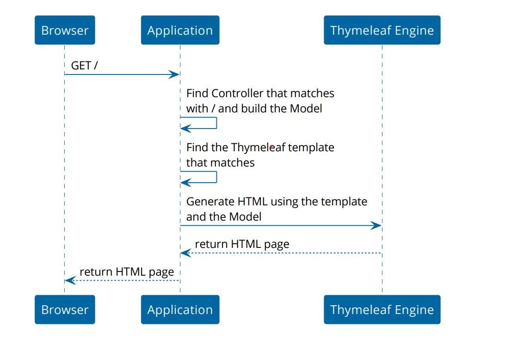

# Spring 6 Thymeleaf

Thymeleaf is a Java template engine for processing and creating HTML, XML, JavaScript, CSS and text.

In this tutorial, we will discuss how to use Thymeleaf with Spring along with some basic use cases in the view layer of
a Spring MVC application.

The library is extremely extensible, and its natural templating capability ensures we can prototype templates without a
back end. This makes development very fast when compared with other popular template engines such as JSP.

1. The browser starts by doing a GET request over the network to the server where the application
   runs.
2. The application will match the requested path of the URL to a Controller. This is a piece of
   software in our application that will build a kind of Map of java objects that will be used by the
   template during rendering. We call this map the Model.
3. The application finds the Thymeleaf template to use for rendering.
4. The application uses the Thymeleaf engine (also running inside the application) to combine the
   template with the Java objects in the model. This results in an HTML page.
5. The application returns the generated HTML page to the browser where the browser renders it.

- [INTEGRATING](INTEGRATING.md)
- [SHOW_MESSAGE_DISPLAY](SHOW_MESSAGE_DISPLAY.md)
- [EXPRESSIONS](EXPRESSIONS.md)
- [CONVERSIONS](CONVERSIONS.md)
- [CONDITIONAL](CONDITIONAL.md)
- [SETTING_ATTRIBUTE_VALUE](SETTING_ATTRIBUTE_VALUE.md)
- [FRAGMENT](FRAGMENT.md)
