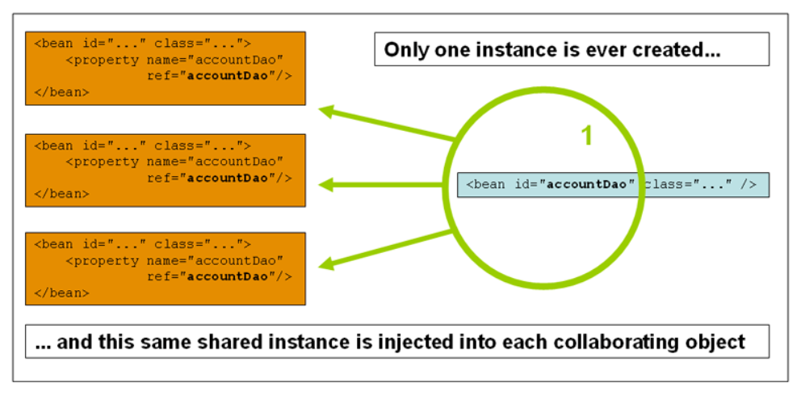
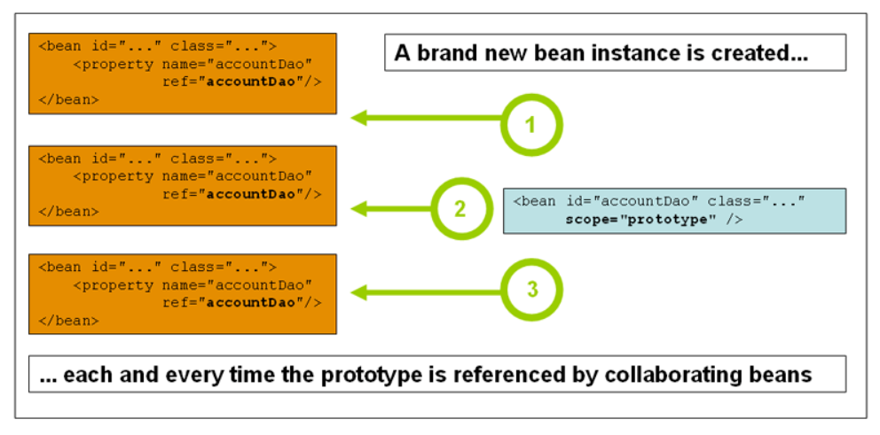

# Bean Scopes

Bean Scopes
When you create a bean definition, you create a recipe for creating actual instances of the class defined by that bean
definition. The idea that a bean definition is a recipe is important, because it means that, as with a class, you can
create many object instances from a single recipe.

You can control not only the various dependencies and configuration values that are to be plugged into an object that is
created from a particular bean definition but also control the scope of the objects created from a particular bean
definition. This approach is powerful and flexible, because you can choose the scope of the objects you create through
configuration instead of having to bake in the scope of an object at the Java class level. Beans can be defined to be
deployed in one of a number of scopes. The Spring Framework supports six scopes, four of which are available only if you
use a web-aware ApplicationContext

_Bean Scopes:_

<table>
    <tr>
        <th>Scope</th>
        <th>Description</th>
    </tr>
    <tr>
        <td>singleton</td>
        <td>(Default) Scopes a single bean definition to a single object instance for each Spring IoC container.</td>
    </tr>
    <tr>
        <td>prototype</td>
        <td>Scopes a single bean definition to any number of object instances.</td>
    </tr>
    <tr>
        <td>request</td>
        <td>Scopes a single bean definition to the lifecycle of a single HTTP request. That is, each HTTP request has its own instance of a bean created off the back of a single bean definition. Only valid in the context of a web-aware Spring ApplicationContext.</td>
    </tr>
    <tr>
        <td>session</td>
        <td>Scopes a single bean definition to the lifecycle of an HTTP `Session`. Only valid in the context of a web-aware Spring `ApplicationContext`.</td>
    </tr>
    <tr>
        <td>application</td>
        <td>Scopes a single bean definition to the lifecycle of a ServletContext. Only valid in the context of a web-aware Spring ApplicationContext.</td>
    </tr>
    <tr>
        <td>websocket</td>
        <td>Scopes a single bean definition to the lifecycle of a WebSocket. Only valid in the context of a web-aware Spring ApplicationContext.</td>
    </tr>
</table>

## The Singleton Scope

Only one shared instance of a singleton bean is managed, and all requests for beans with an ID or IDs that match that
bean definition result in that one specific bean instance being returned by the Spring container.

To put it another way, when you define a bean definition and it is scoped as a singleton, the Spring IoC container
creates exactly one instance of the object defined by that bean definition. This single instance is stored in a cache of
such singleton beans, and all subsequent requests and references for that named bean return the cached object. The
following image shows how the singleton scope works:



Spring’s concept of a singleton bean differs from the singleton pattern as defined in the Gang of Four (GoF) patterns
book. The GoF singleton hard-codes the scope of an object such that one and only one instance of a particular class is
created per ClassLoader. The scope of the Spring singleton is best described as being per-container and per-bean. This
means that, if you define one bean for a particular class in a single Spring container, the Spring container creates one
and only one instance of the class defined by that bean definition. The singleton scope is the default scope in Spring.
To define a bean as a singleton in XML, you can define a bean as shown in the following example:

```xml
<bean id="accountService" class="com.something.DefaultAccountService"/>

<!-- the following is equivalent, though redundant (singleton scope is the default) -->
<bean id="accountService" class="com.something.DefaultAccountService" scope="singleton"/>
```

## The Prototype Scope

The non-singleton prototype scope of bean deployment results in the creation of a new bean instance every time a request
for that specific bean is made. That is, the bean is injected into another bean or you request it through a getBean()
method call on the container. As a rule, you should use the prototype scope for all stateful beans and the singleton
scope for stateless beans.

The following diagram illustrates the Spring prototype scope:



(A data access object (DAO) is not typically configured as a prototype, because a typical DAO does not hold any
conversational state. It was easier for us to reuse the core of the singleton diagram.)

The following example defines a bean as a prototype in XML:

```xml
<bean id="accountService" class="com.something.DefaultAccountService" scope="prototype"/>
```

In contrast to the other scopes, Spring does not manage the complete lifecycle of a prototype bean. The container
instantiates, configures, and otherwise assembles a prototype object and hands it to the client, with no further record
of that prototype instance. Thus, although initialization lifecycle callback methods are called on all objects
regardless of scope, in the case of prototypes, configured destruction lifecycle callbacks are not called. The client
code must clean up prototype-scoped objects and release expensive resources that the prototype beans hold. To get the
Spring container to release resources held by prototype-scoped beans, try using a custom bean post-processor, which
holds a reference to beans that need to be cleaned up.

In some respects, the Spring container’s role in regard to a prototype-scoped bean is a replacement for the Java new
operator. All lifecycle management past that point must be handled by the client. (For details on the lifecycle of a
bean in the Spring container, see Lifecycle Callbacks.)

## Request, Session, Application, and WebSocket Scopes

The request, session, application, and websocket scopes are available only if you use a web-aware Spring
ApplicationContext implementation (such as XmlWebApplicationContext). If you use these scopes with regular Spring IoC
containers, such as the ClassPathXmlApplicationContext, an IllegalStateException that complains about an unknown bean
scope is thrown.

## Request Scope

Consider the following XML configuration for a bean definition:

```xml
<bean id="loginAction" class="com.something.LoginAction" scope="request"/>
```

The Spring container creates a new instance of the LoginAction bean by using the loginAction bean definition for each
and every HTTP request. That is, the loginAction bean is scoped at the HTTP request level. You can change the internal
state of the instance that is created as much as you want, because other instances created from the same loginAction
bean definition do not see these changes in state. They are particular to an individual request. When the request
completes processing, the bean that is scoped to the request is discarded.

When using annotation-driven components or Java configuration, the @RequestScope annotation can be used to assign a
component to the request scope. The following example shows how to do so:

```java

@RequestScope
@Component
public class LoginAction {
    // ...
}
```

## Session Scope

Consider the following XML configuration for a bean definition:

```xml
<bean id="userPreferences" class="com.something.UserPreferences" scope="session"/>
```

The Spring container creates a new instance of the UserPreferences bean by using the userPreferences bean definition for
the lifetime of a single HTTP Session. In other words, the userPreferences bean is effectively scoped at the HTTP
Session level. As with request-scoped beans, you can change the internal state of the instance that is created as much
as you want, knowing that other HTTP Session instances that are also using instances created from the same
userPreferences bean definition do not see these changes in state, because they are particular to an individual HTTP
Session. When the HTTP Session is eventually discarded, the bean that is scoped to that particular HTTP Session is also
discarded.

When using annotation-driven components or Java configuration, you can use the @SessionScope annotation to assign a
component to the session scope.

```java
@SessionScope
@Component
public class UserPreferences {
    // ...
}
```

## Application Scope

Consider the following XML configuration for a bean definition:

```xml
<bean id="appPreferences" class="com.something.AppPreferences" scope="application"/>
```

The Spring container creates a new instance of the AppPreferences bean by using the appPreferences bean definition once
for the entire web application. That is, the appPreferences bean is scoped at the ServletContext level and stored as a
regular ServletContext attribute. This is somewhat similar to a Spring singleton bean but differs in two important ways:
It is a singleton per ServletContext, not per Spring ApplicationContext (for which there may be several in any given web
application), and it is actually exposed and therefore visible as a ServletContext attribute.

When using annotation-driven components or Java configuration, you can use the @ApplicationScope annotation to assign a
component to the application scope. The following example shows how to do so:

```java
@ApplicationScope
@Component
public class AppPreferences {
    // ...
}
```


