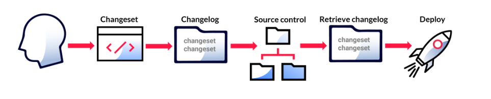

# Spring Liquibase Migration

Liquibase as a tool for managing database schemas and data. Liquibase is a popular open-source database migration tool
that helps manage and automate database schema changes.

- Manage database schema changes: Liquibase allows you to manage database schema changes in a controlled and auditable
  manner. It provides a way to version control database changes and allows you to roll back changes if needed.
- Collaborate with teams: Liquibase enables teams to collaborate on database changes by providing a standardized way to
  manage changes across environments. It also provides tools to validate and deploy changes automatically.

## Overview

Database schema migration is performed on a database whenever it is necessary to update/revert changes in the database
or need to migrate the database from one version to other. There are two major migration tools: Liquibase, Flyway.

The Liquibase is open source tool for database schema migration or database version controlling. It supports most of the
major databases and different type of format for schema change file like XML, SQL, YAML, JSON. It is database vendor
independent means it does not depend on any DB specific syntax. It can generate database change documentation.

```xml
<dependency>
    <groupId>org.liquibase</groupId>
    <artifactId>liquibase-core</artifactId>
    <version>3.6.2</version>
</dependency>
```

# File Formats

Your changelogs can be written in the SQL, XML, YAML, or JSON formats. If you are using the include or includeAll tags
in your root changelog to reference other changelogs, your root changelog must be an XML, YAML, or JSON file.

### XML Example

```xml
<?xml version="1.0" encoding="UTF-8"?>	
<databaseChangeLog
    xmlns="http://www.liquibase.org/xml/ns/dbchangelog"
    xmlns:xsi="http://www.w3.org/2001/XMLSchema-instance"
    xmlns:ext="http://www.liquibase.org/xml/ns/dbchangelog-ext"
    xmlns:pro="http://www.liquibase.org/xml/ns/pro"
    xsi:schemaLocation="http://www.liquibase.org/xml/ns/dbchangelog
        http://www.liquibase.org/xml/ns/dbchangelog/dbchangelog-latest.xsd
        http://www.liquibase.org/xml/ns/dbchangelog-ext http://www.liquibase.org/xml/ns/dbchangelog/dbchangelog-ext.xsd
        http://www.liquibase.org/xml/ns/pro http://www.liquibase.org/xml/ns/pro/liquibase-pro-latest.xsd">
    <preConditions>  
        <runningAs  username="liquibase"/>  
    </preConditions>  

    <changeSet  id="1"  author="nvoxland">  
        <createTable  tableName="person">  
            <column  name="id"  type="int"  autoIncrement="true">  
                <constraints  primaryKey="true"  nullable="false"/>  
            </column>  
            <column  name="firstname"  type="varchar(50)"/>  
            <column  name="lastname"  type="varchar(50)">  
                <constraints  nullable="false"/>  
            </column>  
            <column  name="state"  type="char(2)"/>  
        </createTable>  
    </changeSet>  

    <changeSet  id="2"  author="nvoxland">  
        <addColumn  tableName="person">  
            <column  name="username"  type="varchar(8)"/>  
        </addColumn>  
    </changeSet>  
    <changeSet  id="3"  author="nvoxland">  
        <addLookupTable  
            existingTableName="person"  existingColumnName="state"  
            newTableName="state"  newColumnName="id"  newColumnDataType="char(2)"/>  
    </changeSet>  

</databaseChangeLog>
```

### SQL Example

```sql
--liquibase formatted sql

--changeset nvoxland:1
create table test1 (  
    id int primary key,
    name varchar(255)  
);  
--rollback drop table test1; 

--changeset nvoxland:2 
insert into test1 (id, name) values (1, ‘name 1′);
insert into test1 (id,  name) values (2, ‘name 2′);  

--changeset nvoxland:3 dbms:oracle
create sequence seq_test;
```

### YAML Example

To use YAML-based changelogs, you must include 
[snakeyaml-<version>.jar](https://mvnrepository.com/artifact/org.yaml/snakeyaml) in your classpath.

```yaml
databaseChangeLog:  
  -  preConditions:  
    -  runningAs:  
        username:  liquibase  

  -  changeSet:  
      id:  1  
      author:  nvoxland  
      changes:  
        -  createTable:  
            tableName:  person  
            columns:  
              -  column:  
                  name:  id  
                  type:  int  
                  autoIncrement:  true  
                  constraints:  
                    primaryKey:  true  
                    nullable:  false  
              -  column:  
                  name:  firstname  
                  type:  varchar(50)  
              -  column:  
                  name:  lastname  
                  type:  varchar(50)  
                  constraints:  
                    nullable:  false  
              -  column:  
                  name:  state  
                  type:  char(2)  

  -  changeSet:  
      id:  2  
      author:  nvoxland  
      changes:  
        -  addColumn:  
            tableName:  person  
            columns:  
              -  column:  
                  name:  username  
                  type:  varchar(8)  

  -  changeSet:  
      id:  3  
      author:  nvoxland  
      changes:  
        -  addLookupTable:  
            existingTableName:  person  
            existingColumnName:  state  
            newTableName:  state  
            newColumnName:  id  
            newColumnDataType:  char(2)
```

### JSON Example

```json
{
    "databaseChangeLog": [
      {
        "preConditions": [
          {
            "runningAs": {
              "username": "liquibase"
            }
          }
        ]
      },
      {
        "changeSet": {
          "id": "1",
          "author": "nvoxland",
          "changes": [
            {
              "createTable": {
                "tableName": "person",
                "columns": [
                  {
                    "column": {
                      "name": "id",
                      "type": "int",
                      "autoIncrement": true,
                      "constraints": {
                        "primaryKey": true,
                        "nullable": false
                      },
                      
                    }
                  },
                  {
                    "column": {
                      "name": "firstname",
                      "type": "varchar(50)"
                    }
                  },
                  {
                    "column": {
                      "name": "lastname",
                      "type": "varchar(50)",
                      "constraints": {
                        "nullable": false
                      },
                      
                    }
                  },
                  {
                    "column": {
                      "name": "state",
                      "type": "char(2)"
                    }
                  }
                ]
              }
            }
          ]
        }
      },
      {
        "changeSet": {
          "id": "2",
          "author": "nvoxland",
          "changes": [
            {
              "addColumn": {
                "tableName": "person",
                "columns": [
                  {
                    "column": {
                      "name": "username",
                      "type": "varchar(8)"
                    }
                  }
                ]
              }
            }
          ]
        }
      },
      {
        "changeSet": {
          "id": "3",
          "author": "nvoxland",
          "changes": [
            {
              "addLookupTable": {
                "existingTableName": "person",
                "existingColumnName": "state",
                "newTableName": "state",
                "newColumnName": "id",
                "newColumnDataType": "char(2)",
                
              }
            }
          ]
        }
      }
    ]
}
```

# ChangeSet

A changeset is the basic unit of change in Liquibase. You store all your changesets in your Changelog. Your changesets
contain Change Types that specify what each change does, like creating a new table or adding a column to an existing 
table.

A changeset is uniquely tagged by both the author and id attributes (author:id), as well as the changelog file path. 
The id tag is just an identifier—it doesn't direct the order that changes are run and doesn't have to be an integer. 
To deploy the changeset with the update command, you must include both author and id. You can specify Preconditions, 
Contexts, Labels, and other attributes in individual changesets to control exactly when they run.

It is a best practice to specify only one type of change per changeset. When you deploy your changes, each changeset 
either succeeds or fails; if it fails, you can correct it and deploy again. You can also add comments to individual 
changesets to explain why they're important.



## File Formats

The format of your changeset depends on the file type of your changelog, which can be SQL, XML, YAML, or JSON.

--- 

```xml
<changeSet  id="1"  author="nvoxland">
    <createTable  tableName="company">
        <column  name="address"  type="varchar(255)"/>
    </createTable>
</changeSet>
```

--- 

```sql
--changeset nvoxland:1
create table company (
    id int primary key,
    address varchar(255)
);
```

--- 

```yaml
databaseChangeLog:
  -  changeSet:  
      id:  1
      author:  nvoxland
      changes:
        -  createTable:
            tableName:  company
            columns:
              -  column:
                  name:  address
```

---

```json
{
  "changeSet": {
    "id": "1",
    "author": "nvoxland",
    "changes": [
      {
        "createTable": {
          "tableName": "company",
          "columns": [
            {
              "column": {
                "name": "address"
              }
            }
          ]
        }
      }
    ]
  }
}
```

# Include

Use the include tag in the root changelog to reference other changelogs. In Liquibase, you can break up your root 
changelog into more manageable pieces by creating multiple changelogs to separate your changesets in a way that makes 
sense for you.

- The root changelog file works as a configuration file that will hold all the references to all your other changelogs. 
  Your root changelog file must be in an XML, YAML, or JSON format.
  - `Note: You cannot use the <include> tag in an SQL formatted root changelog.`
  
- Add the <include> tag and file references to your root changelog.
  - `Note: Your reference changelog can be SQL, XML, YAML, or JSON file types.`

---

```xml
<?xml version="1.0" encoding="UTF-8"?>
<databaseChangeLog
    xmlns="http://www.liquibase.org/xml/ns/dbchangelog"
    xmlns:xsi="http://www.w3.org/2001/XMLSchema-instance"
    xmlns:ext="http://www.liquibase.org/xml/ns/dbchangelog-ext"
    xmlns:pro="http://www.liquibase.org/xml/ns/pro"
    xsi:schemaLocation="http://www.liquibase.org/xml/ns/dbchangelog
        http://www.liquibase.org/xml/ns/dbchangelog/dbchangelog-latest.xsd
        http://www.liquibase.org/xml/ns/dbchangelog-ext http://www.liquibase.org/xml/ns/dbchangelog/dbchangelog-ext.xsd
        http://www.liquibase.org/xml/ns/pro http://www.liquibase.org/xml/ns/pro/liquibase-pro-latest.xsd">
	<include file="com/example/news/news.changelog.sql"/>
	<include file="com/example/directory/directory.changelog.sql"/>
</databaseChangeLog>
```

--- 

```yaml
databaseChangeLog:
  - include:
      file: com/example/changelog.demo.xml
  - include:
      file: com/example/db/changelog.json
```

--- 

```json
{
   "databaseChangeLog": [
       {
           "include": {"file": "..\\foo.dbchangelog.h2.json"}
       },
       {
           "include": {"file": "bar\baz.dbchangelog.h2.sql"}
       }
   ]
}
```

# IncludeAll

Use the includeAll tag to specify a directory that contains multiple changelog files. It is used within your root 
changelog file to call on the directory and include all XML, YAML, and JSON files as changelog files, and all SQL files 
as individual changes. If you use includeAll to specify a directory that contains subdirectories, the tag also includes 
all files in those subdirectories.

If you store all of your changelog files in one directory, you can use the <includeAll> tag to reference the directory 
containing those files. Alternatively, you can use <includeAll> to reference a single directory containing multiple 
subdirectories that store all your changelog files.

- Create a root changelog file.

  The root changelog file works as a configuration file that holds all the references to other directories. Your root 
  changelog file must be in an XML, YAML, or JSON format.  

  - `Note: At this time, the <includeAll> tag cannot be used in an SQL formatted root changelog.`
  
- Add the <includeAll> tag and file references to your root changelog.
  - `Note: Your changelogs inside of the directory can be in SQL, XML, YAML, or JSON file types.`

```xml
<?xml version="1.0" encoding="UTF-8"?>
<databaseChangeLog
    xmlns="http://www.liquibase.org/xml/ns/dbchangelog"
    xmlns:xsi="http://www.w3.org/2001/XMLSchema-instance"
    xmlns:ext="http://www.liquibase.org/xml/ns/dbchangelog-ext"
    xmlns:pro="http://www.liquibase.org/xml/ns/pro"
    xsi:schemaLocation="http://www.liquibase.org/xml/ns/dbchangelog
        http://www.liquibase.org/xml/ns/dbchangelog/dbchangelog-latest.xsd
        http://www.liquibase.org/xml/ns/dbchangelog-ext http://www.liquibase.org/xml/ns/dbchangelog/dbchangelog-ext.xsd
        http://www.liquibase.org/xml/ns/pro http://www.liquibase.org/xml/ns/pro/liquibase-pro-latest.xsd">
	<includeAll path="com/example/changelogs/"/>
	<includeAll path="liquibase/parser/core/yaml/included/"/>
</databaseChangeLog>
```

---

```yaml
databaseChangeLog:
   - includeAll:
       path: com/example/changelogs/
   - includeAll:
       path: liquibase/parser/core/yaml/included/
```

---

```json
{
   "databaseChangeLog": [
       {
           "includeAll": {"path": "com/example/changelogs/"}
       },
       {
           "includeAll": {"path": "liquibase/parser/core/yaml/included/"}
       }
   ]
}
```

# Preconditions

Preconditions are tags you add to your changelog or individual changesets to control the execution of an update based 
on the state of the database. Preconditions let you specify security and standardization requirements for your 
changesets. If a precondition on a changeset fails, Liquibase does not deploy that changeset.

```xml
<?xml version="1.1" encoding="UTF-8" standalone="no"?>
<databaseChangeLog
    xmlns="http://www.liquibase.org/xml/ns/dbchangelog"
    xmlns:xsi="http://www.w3.org/2001/XMLSchema-instance"
    xmlns:ext="http://www.liquibase.org/xml/ns/dbchangelog-ext"
    xmlns:pro="http://www.liquibase.org/xml/ns/pro"
    xsi:schemaLocation="http://www.liquibase.org/xml/ns/dbchangelog
        http://www.liquibase.org/xml/ns/dbchangelog/dbchangelog-latest.xsd
        http://www.liquibase.org/xml/ns/dbchangelog-ext http://www.liquibase.org/xml/ns/dbchangelog/dbchangelog-ext.xsd
        http://www.liquibase.org/xml/ns/pro http://www.liquibase.org/xml/ns/pro/liquibase-pro-latest.xsd">

    <preConditions>
        <dbms  type="oracle"  />
        <runningAs  username="SYSTEM"  />
    </preConditions>

    <changeSet  id="1"  author="Liquibase User">
        <preConditions  onFail="WARN">
            <sqlCheck  expectedResult="0">SELECT COUNT(*) FROM example_table</sqlCheck>
        </preConditions>
        <comment>Comments should go after the precondition. Otherwise, Liquibase returns an error.</comment>

        <createTable  tableName="example_table">
            <column name="id" type="int" autoIncrement="true">
                <constraints primaryKey="true" nullable="false">
            </column>
            <column name="firstname" type="varchar(50)">
            <column name="lastname" type="varchar(50)">
                <constraints nullable="false">
            </column>
            <column name="state" type="char(2)">
        </createTable>
    </changeSet>
</databaseChangeLog>
```

---

```sql
-- liquibase formatted sql
			
-- changeset Liquibase User:1
-- precondition-sql-check expectedResult:0 SELECT COUNT(*) FROM example_table
-- comment: /* Comments should go after the precondition. Otherwise, Liquibase returns an error. */
create table example_table (  
	id int primary key,
	firstname varchar(50),
	lastname varchar(50) not null,
	state char(2)
)
```

---

```yaml
databaseChangeLog:
 - preConditions:
     - dbms:
        type: oracle
     - runningAs:
        username: SYSTEM
 - changeSet:
     id:  1
     author: Liquibase User
     preConditions:
       - onFail: WARN
       - sqlCheck:
          expectedResult: 0
          sql: SELECT COUNT(*) FROM example_table
     comment: Comments should go after the precondition. Otherwise, Liquibase returns an error.
     changes:
     - createTable:
         tableName: example_table
         columns:
          - column:
             name: id
             type: int
             autoIncrement: true
             constraints:
              primaryKey: true
              nullable: false
          - column:
             name:  firstname
	         type:  varchar(50)
          - column:
             name:  lastname
             type:  varchar(50)
             constraints:
              nullable:  false
          - column:
             name:  state
             type:  char(2)
```

---

```json
{
  "databaseChangeLog": [
    {
      "preConditions": [
        {
          "dmbs": {
            "type": "oracle"
          }
        },
        {
          "runningAs": {
            "username": "SYSTEM"
          }
        }
      ],
      "changeSet": {
        "id": "1",
        "author": "Liquibase User",
        "preConditions": [
          {
            "onFail": "WARN"
          },
          {
            "sqlCheck": {
              "expectedResult": 0,
              "sql": "SELECT COUNT(*) FROM example_table"
            }
          }
        ],
        "comment": "Comments should go after the precondition. Otherwise, Liquibase returns an error.",
        "changes": [
          {
            "createTable": {
              "tableName": "example_table",
              "columns": [
                {
                  "column": {
                    "name": "id",
                    "type": "int",
                    "autoIncrement": true,
                    "constraints": {
                      "primaryKey": true,
                      "nullable": false
                    }
                  }
                },
                {
                  "column": {
                    "name": "firstname",
                    "type": "varchar(50)"
                  }
                },
                {
                  "column": {
                    "name": "lastname",
                    "type": "varchar(50)",
                    "constraints": {
                      "nullable": false
                    }
                  }
                },
                {
                  "column": {
                    "name": "state",
                    "type": "char(2)"
                  }
                }
              ]
            }
          }
        ]
      }
    }
  ]
}
```

### Multiple preconditions

In XML, JSON, and YAML changelogs, you can set multiple preconditions in one <preConditions> tag by using nestable AND, 
OR, and NOT conditional logic tags. If no conditional tags are specified, the default value is AND.

Liquibase uses lazy evaluation (call-by-need) when running preconditions. For example, if the first condition of an AND
expression fails, Liquibase does not evaluate the second condition. If the first condition of an OR expression succeeds,
Liquibase does not evaluate the second condition.


# runAlways

You can use the runAlways attribute to execute a changeset every time you make a database deployment, even if it has 
been run before.

However, if you need a changeset to repeat an action on every deployment, you can set runAlways to true for that changeset.

`All changelog attributes use the camelCase format.`

The default value for runAlways is false. Set runAlways to true on changesets that you want to execute on every migration.

```xml
<changeSet  id="1"  author="your.name"  runAlways="true">
    <update  tableName="deployment_log">
        <column  name="latest"  type="DATETIME"/>
    </update>
</changeSet>
```

---

```sql
-- changeset your.name:1 runAlways:true
UPDATE deployment_log SET latest=CURRENT_TIMESTAMP;
```

--- 

```yaml
databaseChangeLog:
  -  changeSet:  
      id:  1
      author:  your.name
      runAlways:  true
      changes:
        -  update:
            tableName:  deployment_log
            columns:
              -  column:
                  name:  latest
```

--- 

```json
{
  "changeSet": {
    "id": "1",
    "author": "your.name",
    "runAlways": "true",
    "changes": [
      {
        "update": {
          "tableName": "deployment_log",
          "columns": [
            {
              "column": {
                "name": "latest"
              }
            }
          ]
        }
      }
    ]
  }
}
```