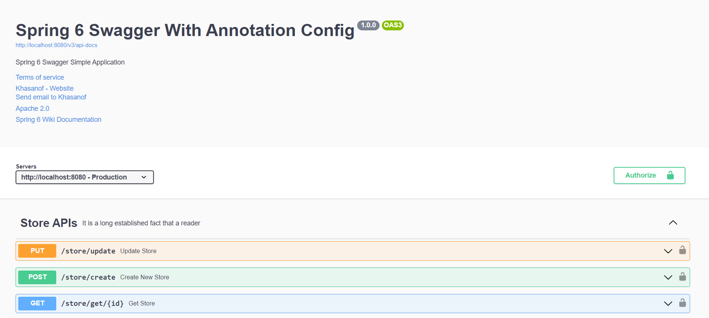
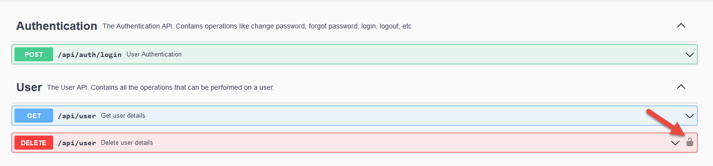
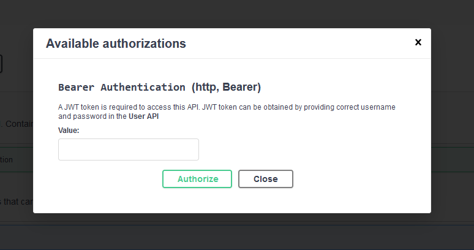
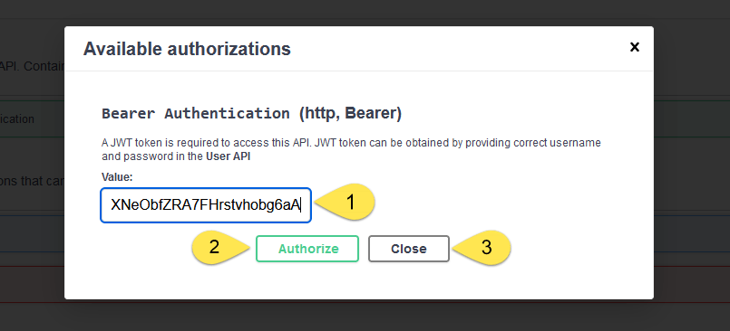
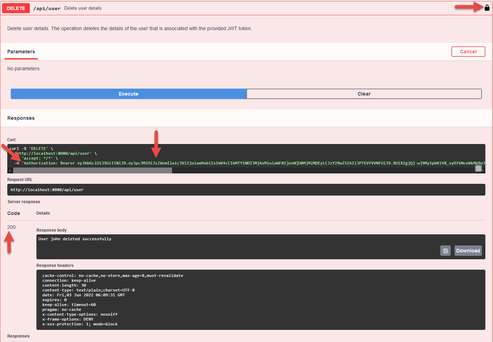
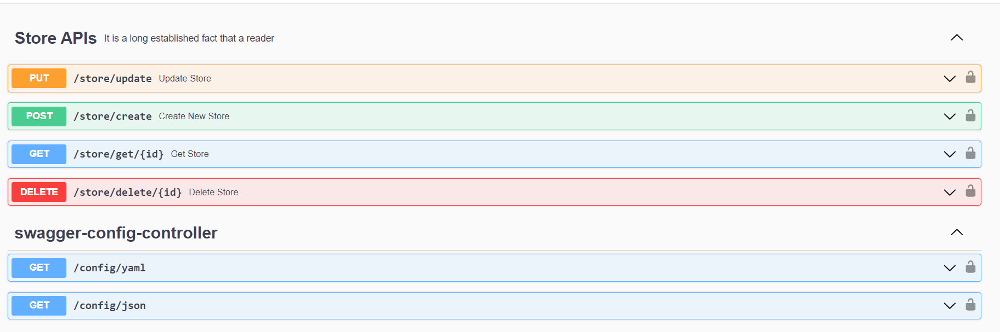

# Swagger Annotation Config

# Overview

OpenAPI is a language-agnostic and platform-independent specification that standardizes the REST APIs. OpenAPI makes it
easy for the users to understand the APIs without dwelling deep into the code. Swagger-UI generates a visual document
from this OpenAPI specification that helps visualize and test the REST APIs.

# Swagger-UI

Swagger-UI, a collection of HTML, Javascript, and CSS files, generates a user interface based on the OpenAPI
specification. Let's use the Springdoc-OpenAPI library to automate the generation of OpenAPI documents for the REST APIs
and use Swagger-UI to visualize these APIs.

Writing an OpenAPI document specification can be challenging when the number of APIs in an application keep increasing.
Springdoc-OpenAPI helps us to auto-generate the OpenAPI document. Further, let's try to use this library and generate
the OpenAPI document.

# @OpenAPIDefinition

The @OpenAPIDefinition annotation in Spring Boot is used to configure the OpenAPI metadata for a Swagger API
documentation. It is used to define global properties of the OpenAPI specification such as the API version, title,
description, and contact information.

You can use the @OpenAPIDefinition annotation in a Spring Boot application to specify metadata for the entire API, such
as the API version, title, and description. This annotation can be used to define the components and security
requirements of the API as well.

```java
@Configuration
@OpenAPIDefinition(
        info = @Info(
                title = "Spring 6 Swagger With Annotation Config",
                version = "${api.version}",
                contact = @Contact(
                        name = "Khasanof", email = "khasanof373@gmail.com", url = "https://github.com/Nurislom373/SpringNews"
                ),
                license = @License(
                        name = "Apache 2.0", url = "https://springdoc.org"),
                termsOfService = "http://swagger.io/terms/",
                description = "Spring 6 Swagger Simple Application"
        ),
        externalDocs = @ExternalDocumentation(
                description = "Spring 6 Wiki Documentation", url = "https://springshop.wiki.github.org/docs"
        ),
        servers = @Server(
                url = "http://localhost:8080",
                description = "Production"
        )
)
public class OpenAPISecurityConfig {
}
```

Overall, the @OpenAPIDefinition annotation is used to configure the global OpenAPI metadata for a Spring Boot 
application, including the API version, title, description, and security requirements.


# Migrating from Springdoc

- Remove springfox and swagger 2 dependencies. Add `springdoc-openapi-starter-webmvc-ui` dependency instead.

```xml
<dependency>
    <groupId>org.springdoc</groupId>
    <artifactId>springdoc-openapi-starter-webmvc-ui</artifactId>
    <version>2.0.4</version>
</dependency>
```

- Replace swagger 2 annotations with swagger 3 annotations (it is already included with 
`springdoc-openapi-starter-webmvc-ui` dependency). Package for swagger 3 annotations is io.swagger.v3.oas.annotations.
  - `@Api` → `@Tag`
  - `@ApiIgnore` → `@Parameter(hidden = true)` or `@Operation(hidden = true)` or `@Hidden`
  - `@ApiImplicitParam` → `@Parameter`
  - `@ApiImplicitParams` → `@Parameters`
  - `@ApiModel` → `@Schema`
  - `@ApiModelProperty(hidden = true)` → `@Schema(accessMode = READ_ONLY)`
  - `@ApiModelProperty` → `@Schema`
  - `@ApiOperation(value = "foo", notes = "bar")` → `@Operation(summary = "foo", description = "bar")`
  - `@ApiParam` → `@Parameter`
  - `@ApiResponse(code = 404, message = "foo")` → `@ApiResponse(responseCode = "404", description = "foo")`

- This step is optional: Only if you have multiple `Docket` beans replace them with `GroupedOpenApi` beans.

Before:

```java
@Bean
public Docket publicApi() {
    return new Docket(DocumentationType.SWAGGER_2)
        .select()
        .apis(RequestHandlerSelectors.basePackage("org.github.springshop.web.public"))
        .paths(PathSelectors.regex("/public.*"))
        .build()
        .groupName("springshop-public")
        .apiInfo(apiInfo());
}

@Bean
public Docket adminApi() {
    return new Docket(DocumentationType.SWAGGER_2)
        .select()
        .apis(RequestHandlerSelectors.basePackage("org.github.springshop.web.admin"))
        .paths(PathSelectors.regex("/admin.*"))
        .apis(RequestHandlerSelectors.withMethodAnnotation(Admin.class))
        .build()
        .groupName("springshop-admin")
        .apiInfo(apiInfo());
```

After - Now:

```java
@Bean
public GroupedOpenApi publicApi() {
    return GroupedOpenApi.builder()
        .group("springshop-public")
        .pathsToMatch("/public/**")
        .build();
}

@Bean
public GroupedOpenApi adminApi() {
    return GroupedOpenApi.builder()
        .group("springshop-admin")
        .pathsToMatch("/admin/**")
        .addMethodFilter(method -> method.isAnnotationPresent(Admin.class))
        .build();
}
```

If you have only one `Docket` — remove it and instead add properties to your application.properties:

```properties
springdoc.packagesToScan=package1, package2
springdoc.pathsToMatch=/v1, /api/balance/**
```

Add bean of OpenAPI type. See example

```java
@Bean
public OpenAPI springShopOpenAPI() {
    return new OpenAPI()
        .info(new Info().title("SpringShop API")
        .description("Spring shop sample application")
        .version("v0.0.1")
        .license(new License().name("Apache 2.0").url("http://springdoc.org")))
        .externalDocs(new ExternalDocumentation()
        .description("SpringShop Wiki Documentation")
        .url("https://springshop.wiki.github.org/docs"));
}
```

# Sample API

Suppose our application has a controller for managing Store:

```java
@RestController
@RequestMapping(value = "/store/*")
public class StoreController {

    @RequestMapping(value = "create", method = RequestMethod.POST)
    public ResponseEntity<Store> create(@Valid @RequestBody Store entity) {
        return new ResponseEntity<>(entity, HttpStatus.CREATED);
    }

    @RequestMapping(value = "update", method = RequestMethod.PUT)
    public ResponseEntity<Store> update(@Valid @RequestBody Store entity) {
        return new ResponseEntity<>(entity, HttpStatus.OK);
    }

    @RequestMapping(value = "delete/{id}", method = RequestMethod.DELETE)
    public ResponseEntity<String> delete(@PathVariable Long id) {
        return new ResponseEntity<>("Successfully Deleted - Store", HttpStatus.NO_CONTENT);
    }
    
    @RequestMapping(value = "get/{id}", method = RequestMethod.GET)
    public ResponseEntity<Store> get(@PathVariable Long id) {
        return new ResponseEntity<>(new Store(id, "Store", "khasanof373@gmail.com",
                20, "The point of using Lorem Ipsum is that it"), HttpStatus.OK);
    }

}
```

Then when we run our application, we can view the documentation at:

`http://localhost:8080/swagger-ui/index.html`

# Automatic Document Generation Using JSR-303 Bean Validation

When our model includes JSR-303 bean validation annotations, such as @NotNull, @NotBlank, @Size, @Min, and @Max, the 
springdoc-openapi library uses them to generate additional schema documentation for the corresponding constraints.

```java
public class Store {
    
    @Min(1)
    @NotNull
    @Parameter(description = "Store Identifier", required = true)
    private Long id;
    
    @NotBlank
    @Size(min = 3, max = 120)
    @Parameter(description = "Store Name", required = true)
    private String name;
    
    @NotBlank
    @Size(min = 9, max = 250)
    @Parameter(description = "Store Email", required = true)
    private String email;
    
    @NotNull
    @Min(1)
    @Parameter(description = "Store EmployeeCount", required = true)
    private int employeeCount;
    
    @Parameter(description = "Store Description", required = false)
    private String desc;
    
}
```

# Generate Documentation Using @Operation, @Tag and @ApiResponses

Next let's see how we can add some description to our API using a couple of OpenAPI-specific annotations.

In order to do that, we'll annotate our controller's /api/book/{id} endpoint with @Operation and @ApiResponses:

```java
@RestController
@RequestMapping(value = "/store/*")
@Tag(name = "Store APIs", description = "It is a long established fact that a reader")
public class StoreController {

    @Operation(summary = "Create New Store", description = "Lorem Ipsum is simply dummy text of the printing and typesetting industry")
    @ApiResponses(value = {
            @ApiResponse(responseCode = "201", description = "Successfully Created", content = {
                    @Content(mediaType = MediaType.APPLICATION_JSON_VALUE,
                            schema = @Schema(implementation = Store.class))
            }),
            @ApiResponse(responseCode = "400", description = "Bad Request", content = {
                    @Content(mediaType = MediaType.APPLICATION_JSON_VALUE,
                            schema = @Schema(implementation = RuntimeException.class))
            }),
            @ApiResponse(responseCode = "500", description = "Internal Server Error", content = {
                    @Content(mediaType = MediaType.APPLICATION_JSON_VALUE,
                            schema = @Schema(implementation = RuntimeException.class))
            })
    })
    @RequestMapping(value = "create", method = RequestMethod.POST)
    public ResponseEntity<Store> create(@Valid @RequestBody Store entity) {
        return new ResponseEntity<>(entity, HttpStatus.CREATED);
    }
    
    // ...
}
```

Here's the effect 



# Swagger JWT Authentication

The @SecurityScheme annotation in Spring Boot Swagger is used to define a security scheme that can be applied to 
specific operations or to the entire API. This annotation is used to specify the security requirements for an API.
The @SecurityScheme annotation allows you to define various types of security schemes, such as API key, HTTP, OAuth2,
and OpenID Connect.

When you use the @SecurityScheme annotation in Spring Boot Swagger, you need to provide some information about the 
security scheme you want to use. For example, if you want to use the OAuth2 security scheme, you need to provide 
information about the OAuth2 authentication server, such as the authorization endpoint, token endpoint, client ID, and 
client secret.

```java
@Configuration
@SecurityScheme(
  name = "Bearer Authentication",
  type = SecuritySchemeType.HTTP,
  bearerFormat = "JWT",
  scheme = "bearer"
)
public class OpenAPI30Configuration {}
```

@SecurityScheme annotation adds the securitySchemes to the components section of the OneAPI Specification. 
@SecurityScheme defines a security mechanism that can be used by our APIs. The supported security schemes are APIKey,
HTTP Authentication (Basic and Bearer), OAuth2, and OpenID Connect. In this case, let's use HTTP Bearer Authentication 
as our security scheme.

For HTTP Bearer token-based authentication, we need to choose the security scheme as bearerAuth and bearer format as JWT.

Since we like to protect only a specific operation, we need to specify the operation that requires authentication. 
For operation-level authentication, we should use the @SecurityRequirement annotation on the operation:

```java
@Operation(summary = "Delete user", description = "Delete user")
@SecurityRequirement(name = "Bearer Authentication")
@DeleteMapping
public String deleteUser(Authentication authentication) {}
```




For this example, a JWT token can be obtained by providing john/password or jane/password to the authentication API. 
Once we get the JWT  token, we can pass it in the value textbox and click on Authorize button and then the Close button:




As a result, we see the operation will be provided with a JWT token as indicated by the icon, and Swagger-UI provides 
this token as an HTTP Bearer in the Authorization header. Finally, with this configuration in place, we can 
successfully invoke the protected deleteUser API.

So far, we have configured an operation-level security configuration. Likewise, let's check the OpenAPI JWT security 
class and global configurations.

# Class Level Configuration

Similarly, we can provide OpenAPI authentication to all the operations in a class. Declare the @SecurityRequirement 
annotation on the class that contains all APIs. Doing so will provide authentication to all the APIs in that particular
class:

```java
@RequestMapping("/api/user")
@RestController
@SecurityRequirement(name = "bearerAuth")
@Tag(name = "User", description = "The User API. Contains all the operations that can be performed on a user.")
public class UserApi {}
```

# Global Configuration

Typically, we prefer to keep the OpenAPI authentication to all the APIs in an application. For these situations, 
we can declare the security at a global level using Spring @Bean annotation:

```java
@Configuration
public class OpenAPI30Configuration {
@Bean
public OpenAPI customizeOpenAPI() {
    final String securitySchemeName = "bearerAuth";
    return new OpenAPI()
      .addSecurityItem(new SecurityRequirement()
        .addList(securitySchemeName))
      .components(new Components()
        .addSecuritySchemes(securitySchemeName, new SecurityScheme()
          .name(securitySchemeName)
          .type(SecurityScheme.Type.HTTP)
          .scheme("bearer")
          .bearerFormat("JWT")));
    }
}
```

With this global configuration, the Springdoc-OpenAPI configures JWT authentication to all the OpenAPIs in the application:




