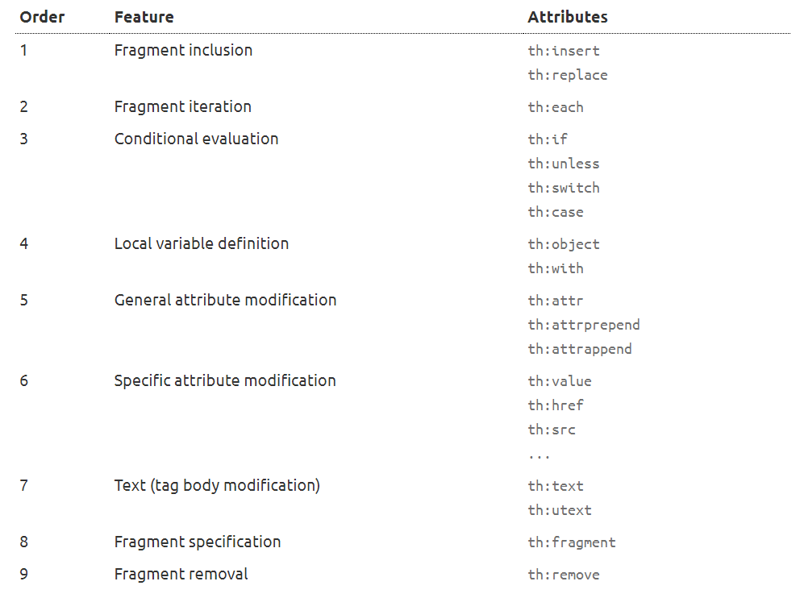

# Thymeleaf

Thymeleaf is a Java template engine for processing and creating HTML, XML, JavaScript, CSS and text.

The library is extremely extensible, and its natural templating capability ensures we can prototype templates without a
back end. This makes development very fast when compared with other popular template engines such as JSP.

The main goal of Thymeleaf is to provide an elegant and highly-maintainable way of creating templates. To achieve this,
it builds on the concept of Natural Templates to inject its logic into template files in a way that doesn’t affect the
template from being used as a design prototype. This improves communication of design and bridges the gap between design
and development teams.

Thymeleaf has also been designed from the beginning with Web Standards in mind – especially HTML5 – allowing you to
create fully validating templates if that is a need for you.

<hr/>

Thymeleaf - bu HTML, XML, JavaScript, CSS va matnlarni qayta ishlash va yaratish uchun Java shablon mexanizmi yani
template engine.

## What kind of templates can Thymeleaf process?

Out-of-the-box, Thymeleaf allows you to process six kinds of templates, each of which is called a Template Mode:

- HTML
- XML
- TEXT
- JAVASCRIPT
- CSS
- RAW

There are two markup template modes (HTML and XML), three textual template modes (TEXT, JAVASCRIPT and CSS) and a no-op
template mode (RAW).

The HTML template mode will allow any kind of HTML input, including HTML5, HTML 4 and XHTML. No validation or
well-formedness check will be performed, and template code/structure will be respected to the biggest possible extent in
output.

The XML template mode will allow XML input. In this case, code is expected to be well-formed – no unclosed tags, no
unquoted attributes, etc – and the parser will throw exceptions if well-formedness violations are found. Note that no
validation (against a DTD or XML Schema) will be performed.

The TEXT template mode will allow the use of a special syntax for templates of a non-markup nature. Examples of such
templates might be text emails or templated documentation. Note that HTML or XML templates can be also processed as
TEXT, in which case they will not be parsed as markup, and every tag, DOCTYPE, comment, etc, will be treated as mere
text.

The JAVASCRIPT template mode will allow the processing of JavaScript files in a Thymeleaf application. This means being
able to use model data inside JavaScript files in the same way it can be done in HTML files, but with
JavaScript-specific integrations such as specialized escaping or natural scripting. The JAVASCRIPT template mode is
considered a textual mode and therefore uses the same special syntax as the TEXT template mode.

The CSS template mode will allow the processing of CSS files involved in a Thymeleaf application. Similar to the
JAVASCRIPT mode, the CSS template mode is also a textual mode and uses the special processing syntax from the TEXT
template mode.

The RAW template mode will simply not process templates at all. It is meant to be used for inserting untouched
resources (files, URL responses, etc.) into the templates being processed. For example, external, uncontrolled resources
in HTML format could be included into application templates, safely knowing that any Thymeleaf code that these resources
might include will not be executed.

## Integrating Thymeleaf With Spring

First, let's see the configurations required to integrate with Spring. The thymeleaf-spring library is required for the
integration.

We'll add the following dependencies to our Maven POM file:

```xml

<dependency>
    <groupId>org.thymeleaf</groupId>
    <artifactId>thymeleaf</artifactId>
    <version>3.0.11.RELEASE</version>
</dependency>
<dependency>
<groupId>org.thymeleaf</groupId>
<artifactId>thymeleaf-spring5</artifactId>
<version>3.0.11.RELEASE</version>
</dependency>
```

The SpringTemplateEngine class performs all of the configuration steps.

We can configure this class as a bean in the Java configuration file:

```java
@Bean
@Description("Thymeleaf Template Resolver")
public ServletContextTemplateResolver templateResolver(){
        ServletContextTemplateResolver templateResolver=new ServletContextTemplateResolver();
        templateResolver.setPrefix("/WEB-INF/views/");
        templateResolver.setSuffix(".html");
        templateResolver.setTemplateMode("HTML5");
        return templateResolver;
        }

@Bean
@Description("Thymeleaf Template Engine")
public SpringTemplateEngine templateEngine(){
        SpringTemplateEngine templateEngine=new SpringTemplateEngine();
        templateEngine.setTemplateResolver(templateResolver());
        templateEngine.setTemplateEngineMessageSource(messageSource());
        return templateEngine;
        }
```

The templateResolver bean properties prefix and suffix indicate the location of the view pages within the webapp
directory and their filename extension, respectively.

The ViewResolver interface in Spring MVC maps the view names returned by a controller to actual view objects.
ThymeleafViewResolver implements the ViewResolver interface, and it's used to determine which Thymeleaf views to render,
given a view name.

```java
@Bean
@Description("Thymeleaf View Resolver")
public ThymeleafViewResolver viewResolver(){
        ThymeleafViewResolver viewResolver=new ThymeleafViewResolver();
        viewResolver.setTemplateEngine(templateEngine());
        viewResolver.setOrder(1);
        return viewResolver;
        }
```

## Thymeleaf in Spring Boot

Spring Boot provides auto-configuration for Thymeleaf by adding the spring-boot-starter-thymeleaf dependency:

```xml

<dependency>
    <groupId>org.springframework.boot</groupId>
    <artifactId>spring-boot-starter-thymeleaf</artifactId>
    <version>2.3.3.RELEASE</version>
</dependency>
```

No explicit configuration is necessary. By default, HTML files should be placed in the resources/templates location.

<hr/>

Spring Boot ga thymeleaf dependency qo'shasiz shuni o'zi yetarli hech qanday konfiguratsiya shart emas.
_resources/templates_ ga HTML larni yaratib thymeleaf bilan ishlayverasiz.

## Displaying Values From Message Source (Property Files)

We can use the th:text=”#{key}” tag attribute to display values from property files.

For this to work, we need to configure the property file as a messageSource bean:

<hr/>

properties filelaridagi valuelarni ko'rsatish uchun biz _th:text="#{key}"_ tag atributidan foydalanishimiz mumkin.

Buning ishlashi uchun biz properties faylini messageSource bean sifatida sozlashimiz kerak:

```java
@Bean
@Description("Spring Message Resolver")
public ResourceBundleMessageSource messageSource(){
        ResourceBundleMessageSource messageSource=new ResourceBundleMessageSource();
        messageSource.setBasename("messages");
        return messageSource;
        }
```

Here is the Thymeleaf HTML code to display the value associated with the key welcome.message:

```html
<span th:text="#{welcome.message}"/>
```

```html
<!DOCTYPE html>

<html xmlns:th="http://www.thymeleaf.org">

<head>
    <title>Good Thymes Virtual Grocery</title>
    <meta http-equiv="Content-Type" content="text/html; charset=UTF-8"/>
    <link rel="stylesheet" type="text/css" media="all"
          href="../../css/gtvg.css" th:href="@{/css/gtvg.css}"/>
</head>

<body>

<p th:text="#{home.welcome}">Welcome to our grocery store!</p>

</body>

</html>
```

The first thing you will notice is that this file is HTML5 that can be correctly displayed by any browser because it
does not include any non-HTML tags (browsers ignore all attributes they don’t understand, like th:text).

But you may also notice that this template is not really a valid HTML5 document, because these non-standard attributes
we are using in the th:* form are not allowed by the HTML5 specification. In fact, we are even adding an xmlns:th
attribute to our <html> tag, something absolutely non-HTML5-ish:

```html

<html xmlns:th="http://www.thymeleaf.org">
```

## Messages

As we already know, #{...} message expressions allow us to link this:

```html
<p th:utext="#{home.welcome}">Welcome to our grocery store!</p>
```

...to this:

```properties
home.welcome=¡Bienvenido a nuestra tienda de comestibles!
```

But there’s one aspect we still haven’t thought of: what happens if the message text is not completely static? What if,
for example, our application knew who is the user visiting the site at any moment and we wanted to greet them by name?

```html
<p>¡Bienvenido a nuestra tienda de comestibles, John Apricot!</p>
```

This means we would need to add a parameter to our message. Just like this:

```properties
home.welcome=¡Bienvenido a nuestra tienda de comestibles, {0}!
```

Parameters are specified according to the java.text.MessageFormat standard syntax, which means you can format to numbers
and dates as specified in the API docs for classes in the java.text.* package.

In order to specify a value for our parameter, and given an HTTP session attribute called user, we could have:

```html
<p th:utext="#{home.welcome(${session.user.name})}">
    Welcome to our grocery store, Sebastian Pepper!
</p>
```

Several parameters can be specified, separated by commas.
The message key itself can come from a variable:

```html
<p th:utext="#{${welcomeMsgKey}(${session.user.name})}">
    Welcome to our grocery store, Sebastian Pepper!
</p>
```

## Variables

We already mentioned that ${...} expressions are in fact OGNL (Object-Graph Navigation Language) expressions executed on
the map of variables contained in the context.

```
For detailed info about OGNL syntax and features, you should read the OGNL Language Guide

In Spring MVC-enabled applications OGNL will be replaced with SpringEL, but its syntax is very similar to that of OGNL (
actually, exactly the same for most common cases).
```

We can use the th:text=”${attributename}” tag attribute to display the value of model attributes.
Let's add a model attribute with the name serverTime in the controller class:

<hr/>

Model atributlari qiymatini ko‘rsatish uchun th:text=”${attributename}” teg atributidan foydalanishimiz mumkin.
Controller classiga serverTime nomli model atributini qo'shamiz:

```java
model.addAttribute("serverTime",dateFormat.format(new Date()));
```

And here's the HTML code to display the value of serverTime attribute:

```html
Current time is <span th:text="${serverTime}"/>
```

```html
/*
* Access to properties using the point (.). Equivalent to calling property getters.
*/
${person.father.name}

/*
* Access to properties can also be made by using brackets ([]) and writing
* the name of the property as a variable or between single quotes.
*/
${person['father']['name']}

/*
* If the object is a map, both dot and bracket syntax will be equivalent to
* executing a call on its get(...) method.
*/
${countriesByCode.ES}
${personsByName['Stephen Zucchini'].age}

/*
* Indexed access to arrays or collections is also performed with brackets,
* writing the index without quotes.
*/
${personsArray[0].name}

/*
* Methods can be called, even with arguments.
*/
${person.createCompleteName()}
${person.createCompleteNameWithSeparator('-')}
```

## Expression Basic Objects

When evaluating OGNL expressions on the context variables, some objects are made available to expressions for higher
flexibility. These objects will be referenced (per OGNL standard) starting with the # symbol:

- #ctx: the context object.
- #vars: the context variables
- #locale: the context locale

So we can do this:

```html
Established locale country: <span th:text="${#locale.country}">US</span>.
```

### Expression Utility Objects

Besides these basic objects, Thymeleaf will offer us a set of utility objects that will help us perform common tasks in
our expressions.

- #execInfo: information about the template being processed.
- #messages: methods for obtaining externalized messages inside variables expressions, in the same way as they would be
  obtained using #{…} syntax.
- #uris: methods for escaping parts of URLs/URIs
- #conversions: methods for executing the configured conversion service (if any).
- #dates: methods for java.util.Date objects: formatting, component extraction, etc.
- #calendars: analogous to #dates, but for java.util.Calendar objects.
- #temporals: for dealing with dates and times using the java.time API in JDK8+.
- #numbers: methods for formatting numeric objects.
- #strings: methods for String objects: contains, startsWith, prepending/appending, etc.
- #objects: methods for objects in general.
- #bools: methods for boolean evaluation.
- #arrays: methods for arrays.
- #lists: methods for lists.
- #sets: methods for sets.
- #maps: methods for maps.
- #aggregates: methods for creating aggregates on arrays or collections.
- #ids: methods for dealing with id attributes that might be repeated (for example, as a result of an iteration).

### Collection Attributes

If the model attribute is a collection of objects, we can use the th:each tag attribute to iterate over it.
Let's define a Student model class with two fields, id and name:

<hr/>

Agar model atributi ob'ektlar to'plami bo'lsa, biz uni takrorlash uchun th:each teg atributidan foydalanishimiz mumkin.

```java
public class Student implements Serializable {
    private Integer id;
    private String name;
    // standard getters and setters
}
```

Now we will add a list of students as model attribute in the controller class:

```java
List<Student> students=new ArrayList<Student>();
// logic to build student data
        model.addAttribute("students",students);
```

Finally, we can use Thymeleaf template code to iterate over the list of students and display all field values:

```html

<tbody>
<tr th:each="student: ${students}">
    <td th:text="${student.id}"/>
    <td th:text="${student.name}"/>
</tr>
</tbody>
```

## Standard Expression Syntax

We will take a small break in the development of our grocery virtual store to learn about one of the most important
parts of the Thymeleaf Standard Dialect: the Thymeleaf Standard Expression syntax.

We have already seen two types of valid attribute values expressed in this syntax: message and variable expressions:

```html
<p th:utext="#{home.welcome}">Welcome to our grocery store!</p>

<p>Today is: <span th:text="${today}">13 february 2011</span></p>
```

But there are more types of expressions, and more interesting details to learn about the ones we already know. First,
let’s see a quick summary of the Standard Expression features:

- Simple Expressions:
    - Variable Expressions: ${...}
    - Selection Variable Expressions: *{...}
    - Message Expressions: #{...}
    - Link URL Expressions: @{...}
    - Fragment Expressions: ~{...}

- Literals
    - Text literals: 'one text', 'Another one!',…
    - Number literals: 0, 34, 3.0, 12.3,…
    - Boolean literals: true, false
    - Null literal: null
    - Literal tokens: one, sometext, main,…
- Text operations
    - String concatenation: +
    - Literal substitutions: |The name is ${name}|
- Arithmetic operations:
    - Binary operators: +, -, *, /, %
    - Minus sign (unary operator): -
- Boolean operations:
    - Binary operators: and, or
    - Boolean negation (unary operator): !, not
- Comparisons and equality:
    - Comparators: >, <, >=, <= (gt, lt, ge, le)
    - Equality operators: ==, != (eq, ne)
- Conditional operators:
    - If-then: (if) ? (then)
    - If-then-else: (if) ? (then) : (else)
    - Default: (value) ?: (defaultvalue)
- Special tokens
    - No-Operation: _

```html
'User is of type ' + (${user.isAdmin()} ? 'Administrator' : (${user.type} ?: 'Unknown'))
```

## 4.3 Expressions on selections (asterisk syntax)

Not only can variable expressions be written as ${...}, but also as *{...}.

There is an important difference though: the asterisk syntax evaluates expressions on selected objects rather than on
the whole context. That is, as long as there is no selected object, the dollar and the asterisk syntaxes do exactly the
same.

And what is a selected object? The result of an expression using the th:object attribute. Let’s use one in our user
profile (userprofile.html) page:

```html

<div th:object="${session.user}">
    <p>Name: <span th:text="*{firstName}">Sebastian</span>.</p>
    <p>Surname: <span th:text="*{lastName}">Pepper</span>.</p>
    <p>Nationality: <span th:text="*{nationality}">Saturn</span>.</p>
</div>
```

Which is exactly equivalent to:

```html

<div>
    <p>Name: <span th:text="${session.user.firstName}">Sebastian</span>.</p>
    <p>Surname: <span th:text="${session.user.lastName}">Pepper</span>.</p>
    <p>Nationality: <span th:text="${session.user.nationality}">Saturn</span>.</p>
</div>
```

## 4.4 Links

Because of their importance, URLs are first-class citizens in web application templates, and the Thymeleaf Standard
Dialect has a special syntax for them, the @ syntax: @{...}

There are different types of URLs:

- Absolute URLs: http://www.thymeleaf.org
- Relative URLs, which can be:
    - Page-relative: user/login.html
    - Context-relative: /itemdetails?id=3 (context name in server will be added automatically)
    - Server-relative: ~/billing/processInvoice (allows calling URLs in another context (= application) in the same
      server.
    - Protocol-relative URLs: //code.jquery.com/jquery-2.0.3.min.js

```html
<!-- Will produce 'http://localhost:8080/gtvg/order/details?orderId=3' (plus rewriting) -->
<a href="details.html"
   th:href="@{http://localhost:8080/gtvg/order/details(orderId=${o.id})}">view</a>

<!-- Will produce '/gtvg/order/details?orderId=3' (plus rewriting) -->
<a href="details.html" th:href="@{/order/details(orderId=${o.id})}">view</a>

<!-- Will produce '/gtvg/order/3/details' (plus rewriting) -->
<a href="details.html" th:href="@{/order/{orderId}/details(orderId=${o.id})}">view</a>
```

As was the case with the message syntax (#{...}), URL bases can also be the result of evaluating another expression:

```html
<a th:href="@{${url}(orderId=${o.id})}">view</a>
<a th:href="@{'/details/'+${user.login}(orderId=${o.id})}">view</a>
```

## 4.6 Literals

### Text Literals

Text literals are just character strings specified between single quotes. They can include any character, but you should
escape any single quotes inside them using \'.

```html
<p>
    Now you are looking at a <span th:text="'working web application'">template file</span>.
</p>
```

### Number Literals

Numeric literals are just that: numbers.

```html
<p>The year is <span th:text="2013">1492</span>.</p>
<p>In two years, it will be <span th:text="2013 + 2">1494</span>.</p>
```

### Boolean Literals

The boolean literals are true and false. For example:

```html

<div th:if="${user.isAdmin()} == false"> ...
```

Literal tokens
<hr/>
Numeric, boolean and null literals are in fact a particular case of literal tokens.

These tokens allow a little bit of simplification in Standard Expressions. They work exactly the same as text
literals ('...'), but they only allow letters (A-Z and a-z), numbers (0-9), brackets ([ and ]), dots (.), hyphens (-)
and underscores (_). So no whitespaces, no commas, etc.

## Appending Texts

Texts, no matter whether they are literals or the result of evaluating variable or message expressions, can be easily
appended using the + operator:

```html
<span th:text="'The name of the user is ' + ${user.name}">
```

## Literal substitutions

Literal substitutions allow for an easy formatting of strings containing values from variables without the need to
append literals with '...' + '...'.

These substitutions must be surrounded by vertical bars (|), like:

```html
<span th:text="|Welcome to our application, ${user.name}!|">
```

Which is equivalent to:

```html
<span th:text="'Welcome to our application, ' + ${user.name} + '!'">
```

Literal substitutions can be combined with other types of expressions:

```html
<span th:text="${onevar} + ' ' + |${twovar}, ${threevar}|">
```

```
Only variable/message expressions (${...}, *{...}, #{...}) are allowed inside |...| literal substitutions. 
No other literals ('...'), boolean/numeric tokens, conditional expressions etc. are.
```

### Arithmetic operations

Some arithmetic operations are also available: +, -, *, / and %.

```html

<div th:with="isEven=(${prodStat.count} % 2 == 0)">
```

### Comparators and Equality

Values in expressions can be compared with the >, <, >= and <= symbols, and the == and != operators can be used to check
for equality (or the lack of it). Note that XML establishes that the < and > symbols should not be used in attribute
values, and so they should be substituted by &lt; and &gt;.

```html

<div th:if="${prodStat.count} &gt; 1">
    <span th:text="'Execution mode is ' + ( (${execMode} == 'dev')? 'Development' : 'Production')">
```

A simpler alternative may be using textual aliases that exist for some of these operators: gt (>), lt (<), ge (>=),
le (<=), not (!). Also eq (==), neq/ne (!=).

### Conditional expressions

Conditional expressions are meant to evaluate only one of two expressions depending on the result of evaluating a
condition (which is itself another expression).

Let’s have a look at an example fragment (introducing another attribute modifier, th:class):

```html

<tr th:class="${row.even}? 'even' : 'odd'">
    ...
</tr>
```

All three parts of a conditional expression (condition, then and else) are themselves expressions, which means that they
can be variables (${...}, *{...}), messages (#{...}), URLs (@{...}) or literals ('...').

Conditional expressions can also be nested using parentheses:

```html

<tr th:class="${row.even}? (${row.first}? 'first' : 'even') : 'odd'">
    ...
</tr>
```

### Default expressions (Elvis operator)

A default expression is a special kind of conditional value without a then part. It is equivalent to the Elvis operator
present in some languages like Groovy, lets you specify two expressions: the first one is used if it doesn’t evaluate to
null, but if it does then the second one is used.

Let’s see it in action in our user profile page:

```html

<div th:object="${session.user}">
    ...
    <p>Age: <span th:text="*{age}?: '(no age specified)'">27</span>.</p>
</div>
```

As you can see, the operator is ?:, and we use it here to specify a default value for a name (a literal value, in this
case) only if the result of evaluating *{age} is null. This is therefore equivalent to:

```html
<p>Age: <span th:text="*{age != null}? *{age} : '(no age specified)'">27</span>.</p>
```

### Data Conversion / Formatting

Thymeleaf defines a double-brace syntax for variable (${...}) and selection (*{...}) expressions that allows us to apply
data conversion by means of a configured conversion service.

```html

<td th:text="${{user.lastAccessDate}}">...</td>
```

Noticed the double brace there?: ${{...}}. That instructs Thymeleaf to pass the result of the user.lastAccessDate
expression to the conversion service and asks it to perform a formatting operation (a conversion to String) before
writing the result.

Assuming that user.lastAccessDate is of type java.util.Calendar, if a conversion service (implementation of
IStandardConversionService) has been registered and contains a valid conversion for Calendar -> String, it will be
applied.

The default implementation of IStandardConversionService (the StandardConversionService class) simply executes
.toString() on any object converted to String.

```html

<tr th:each="student: ${students}">
    <td th:text="${{student.name}}"/>
</tr>
```

We can also use the #conversions utility to convert objects for display. The syntax for the utility function is
#conversions.convert(Object, Class) where Object is converted to Class type.

Here's how to display student object percentage field with the fractional part removed:

```html
<tr th:each="student: ${students}">
    <td th:text="${#conversions.convert(student.percentage, 'Integer')}" />
</tr>
```

# Setting Attribute Values

This chapter will explain the way in which we can set (or modify) values of attributes in our markup.

### Setting the value of any attribute

```html

<form action="subscribe.html">
    <fieldset>
        <input type="text" name="email"/>
        <input type="submit" value="Subscribe!"/>
    </fieldset>
</form>
```

As with Thymeleaf, this template starts off more like a static prototype than it does a template for a web application.
First, the action attribute in our form statically links to the template file itself, so that there is no place for
useful URL rewriting. Second, the value attribute in the submit button makes it display a text in English, but we’d like
it to be internationalized.

Enter then the th:attr attribute, and its ability to change the value of attributes of the tags it is set in:

```html

<form action="subscribe.html" th:attr="action=@{/subscribe}">
    <fieldset>
        <input type="text" name="email"/>
        <input type="submit" value="Subscribe!" th:attr="value=#{subscribe.submit}"/>
    </fieldset>
</form>
```

Setting more than one value at a time

```html

```

Given the required messages files, this will output:

```html

```

### Appending and prepending

Thymeleaf also offers the th:attrappend and th:attrprepend attributes, which append (suffix) or prepend (prefix) the
result of their evaluation to the existing attribute values.

For example, you might want to store the name of a CSS class to be added (not set, just added) to one of your buttons in
a context variable, because the specific CSS class to be used would depend on something that the user did before:

```html
<input type="button" value="Do it!" class="btn" th:attrappend="class=${' ' + cssStyle}"/>
```

If you process this template with the cssStyle variable set to "warning", you will get:

```html
<input type="button" value="Do it!" class="btn warning"/>
```

There are also two specific appending attributes in the Standard Dialect: the th:classappend and th:styleappend
attributes, which are used for adding a CSS class or a fragment of style to an element without overwriting the existing
ones:

```html

<tr th:each="prod : ${prods}" class="row" th:classappend="${prodStat.odd}? 'odd'">
```

# Iteration

The Standard Dialect offers us an attribute for exactly that: th:each.

And then we will use th:each in our template to iterate over the list of products:

```html
<!DOCTYPE html>

<html xmlns:th="http://www.thymeleaf.org">

<head>
    <title>Good Thymes Virtual Grocery</title>
    <meta http-equiv="Content-Type" content="text/html; charset=UTF-8"/>
    <link rel="stylesheet" type="text/css" media="all"
          href="../../../css/gtvg.css" th:href="@{/css/gtvg.css}"/>
</head>

<body>

<h1>Product list</h1>

<table>
    <tr>
        <th>NAME</th>
        <th>PRICE</th>
        <th>IN STOCK</th>
    </tr>
    <tr th:each="prod : ${prods}">
        <td th:text="${prod.name}">Onions</td>
        <td th:text="${prod.price}">2.41</td>
        <td th:text="${prod.inStock}? #{true} : #{false}">yes</td>
    </tr>
</table>

<p>
    <a href="../home.html" th:href="@{/}">Return to home</a>
</p>

</body>

</html>
```

That prod : ${prods} attribute value you see above means “for each element in the result of evaluating ${prods}, repeat
this fragment of template, using the current element in a variable called prod”. Let’s give a name each of the things we
see:

- We will call ${prods} the iterated expression or iterated variable.
- We will call prod the iteration variable or simply iter variable.

Note that the prod iter variable is scoped to the <tr> element, which means it is available to inner tags like <td>.

### Iterable values

The java.util.List class isn’t the only value that can be used for iteration in Thymeleaf. There is a quite complete set
of objects that are considered iterable by a th:each attribute:

- Any object implementing java.util.Iterable
- Any object implementing java.util.Enumeration.
- Any object implementing java.util.Iterator, whose values will be used as they are returned by the iterator, without
  the need to cache all values in memory.
- Any object implementing java.util.Map. When iterating maps, iter variables will be of class java.util.Map.Entry.
- Any object implementing java.util.stream.Stream.
- Any array.
- Any other object will be treated as if it were a single-valued list containing the object itself.

When using th:each, Thymeleaf offers a mechanism useful for keeping track of the status of your iteration: the status
variable.

```html

<table>
    <tr>
        <th>NAME</th>
        <th>PRICE</th>
        <th>IN STOCK</th>
    </tr>
    <tr th:each="prod,iterStat : ${prods}" th:class="${iterStat.odd}? 'odd'">
        <td th:text="${prod.name}">Onions</td>
        <td th:text="${prod.price}">2.41</td>
        <td th:text="${prod.inStock}? #{true} : #{false}">yes</td>
    </tr>
</table>
```

The status variable (iterStat in this example) is defined in the th:each attribute by writing its name after the iter
variable itself, separated by a comma. Just like the iter variable, the status variable is also scoped to the fragment
of code defined by the tag holding the th:each attribute.

Let’s have a look at the result of processing our template:

```html
<!DOCTYPE html>

<html>

<head>
    <title>Good Thymes Virtual Grocery</title>
    <meta content="text/html; charset=UTF-8" http-equiv="Content-Type"/>
    <link rel="stylesheet" type="text/css" media="all" href="/gtvg/css/gtvg.css"/>
</head>

<body>

<h1>Product list</h1>

<table>
    <tr>
        <th>NAME</th>
        <th>PRICE</th>
        <th>IN STOCK</th>
    </tr>
    <tr class="odd">
        <td>Fresh Sweet Basil</td>
        <td>4.99</td>
        <td>yes</td>
    </tr>
    <tr>
        <td>Italian Tomato</td>
        <td>1.25</td>
        <td>no</td>
    </tr>
    <tr class="odd">
        <td>Yellow Bell Pepper</td>
        <td>2.50</td>
        <td>yes</td>
    </tr>
    <tr>
        <td>Old Cheddar</td>
        <td>18.75</td>
        <td>yes</td>
    </tr>
</table>

<p>
    <a href="/gtvg/" shape="rect">Return to home</a>
</p>

</body>

</html>
```

# Conditional Evaluation

### Simple conditionals: “if” and “unless”

Sometimes you will need a fragment of your template to only appear in the result if a certain condition is met.

For example, imagine we want to show in our product table a column with the number of comments that exist for each
product and, if there are any comments, a link to the comment detail page for that product.

In order to do this, we would use the th:if attribute:

```html

<td>
    <span th:if="${student.gender} == 'M'" th:text="Male"/>
    <span th:unless="${student.gender} == 'M'" th:text="Female"/>
</td>
```

```html

<table>
    <tr>
        <th>NAME</th>
        <th>PRICE</th>
        <th>IN STOCK</th>
        <th>COMMENTS</th>
    </tr>
    <tr th:each="prod : ${prods}" th:class="${prodStat.odd}? 'odd'">
        <td th:text="${prod.name}">Onions</td>
        <td th:text="${prod.price}">2.41</td>
        <td th:text="${prod.inStock}? #{true} : #{false}">yes</td>
        <td>
            <span th:text="${#lists.size(prod.comments)}">2</span> comment/s
            <a href="comments.html"
               th:href="@{/product/comments(prodId=${prod.id})}"
               th:if="${not #lists.isEmpty(prod.comments)}">view</a>
        </td>
    </tr>
</table>
```

Let’s have a look at the resulting markup:

```html

<table>
    <tr>
        <th>NAME</th>
        <th>PRICE</th>
        <th>IN STOCK</th>
        <th>COMMENTS</th>
    </tr>
    <tr>
        <td>Fresh Sweet Basil</td>
        <td>4.99</td>
        <td>yes</td>
        <td>
            <span>0</span> comment/s
        </td>
    </tr>
    <tr class="odd">
        <td>Italian Tomato</td>
        <td>1.25</td>
        <td>no</td>
        <td>
            <span>2</span> comment/s
            <a href="/gtvg/product/comments?prodId=2">view</a>
        </td>
    </tr>
    <tr>
        <td>Yellow Bell Pepper</td>
        <td>2.50</td>
        <td>yes</td>
        <td>
            <span>0</span> comment/s
        </td>
    </tr>
    <tr class="odd">
        <td>Old Cheddar</td>
        <td>18.75</td>
        <td>yes</td>
        <td>
            <span>1</span> comment/s
            <a href="/gtvg/product/comments?prodId=4">view</a>
        </td>
    </tr>
</table>
```

### Switch statements

There is also a way to display content conditionally using the equivalent of a switch structure in Java: the th:switch /
th:case attribute set.

```html

<div th:switch="${user.role}">
    <p th:case="'admin'">User is an administrator</p>
    <p th:case="#{roles.manager}">User is a manager</p>
</div>
```

# Template Layout

### Including template fragments

In our templates, we will often want to include parts from other templates, parts like footers, headers, menus…

In order to do this, Thymeleaf needs us to define these parts, “fragments”, for inclusion, which can be done using the
th:fragment attribute.

Say we want to add a standard copyright footer to all our grocery pages, so we create a /WEB-INF/templates/footer.html
file containing this code:

```html
<!DOCTYPE html>

<html xmlns:th="http://www.thymeleaf.org">

<body>

<div th:fragment="copy">
    &copy; 2011 The Good Thymes Virtual Grocery
</div>

</body>

</html>
```

The code above defines a fragment called copy that we can easily include in our home page using one of the th:insert or
th:replace attributes:

```html

<body>

...

<div th:insert="~{footer :: copy}"></div>

</body>
```

```html

<div th:insert="~{ footer :: (${user.isAdmin}? #{footer.admin} : #{footer.normaluser}) }"></div>
```

### Difference between th:insert and th:replace

- th:insert will simply insert the specified fragment as the body of its host tag.
- th:replace actually replaces its host tag with the specified fragment.

```html

<footer th:fragment="copy">
    &copy; 2011 The Good Thymes Virtual Grocery
</footer>
```

…included twice in host <div> tags, like this:

```html

<body>

...

<div th:insert="~{footer :: copy}"></div>

<div th:replace="~{footer :: copy}"></div>

</body>
```

…will result in:

```html

<body>

...

<div>
    <footer>
        &copy; 2011 The Good Thymes Virtual Grocery
    </footer>
</div>

<footer>
    &copy; 2011 The Good Thymes Virtual Grocery
</footer>

</body>
```

### Parameterizable fragment signatures

In order to create a more function-like mechanism for template fragments, fragments defined with th:fragment can specify
a set of parameters:

```html

<div th:fragment="frag (onevar,twovar)">
    <p th:text="${onevar} + ' - ' + ${twovar}">...</p>
</div>
```

This requires the use of one of these two syntaxes to call the fragment from th:insert or th:replace:

```html

<div th:replace="~{ ::frag (${value1},${value2}) }">...</div>
<div th:replace="~{ ::frag (onevar=${value1},twovar=${value2}) }">...</div>
```

Note that order is not important in the last option:

```html

<div th:replace="~{ ::frag (twovar=${value2},onevar=${value1}) }">...</div>
```

### Flexible layouts: beyond mere fragment insertion

Thanks to fragment expressions, we can specify parameters for fragments that are not texts, numbers, bean objects… but
instead fragments of markup.

This allows us to create our fragments in a way such that they can be enriched with markup coming from the calling
templates, resulting in a very flexible template layout mechanism.

Note the use of the title and links variables in the fragment below:

```html

<head th:fragment="common_header(title,links)">

    <title th:replace="${title}">The awesome application</title>

    <!-- Common styles and scripts -->
    <link rel="stylesheet" type="text/css" media="all" th:href="@{/css/awesomeapp.css}">
    <link rel="shortcut icon" th:href="@{/images/favicon.ico}">
    <script type="text/javascript" th:src="@{/sh/scripts/codebase.js}"></script>

    <!--/* Per-page placeholder for additional links */-->
    <th:block th:replace="${links}"/>

</head>
```

We can now call this fragment like:

```html
...
<head th:replace="~{ base :: common_header(~{::title},~{::link}) }">

    <title>Awesome - Main</title>

    <link rel="stylesheet" th:href="@{/css/bootstrap.min.css}">
    <link rel="stylesheet" th:href="@{/themes/smoothness/jquery-ui.css}">

</head>
...
```

…and the result will use the actual <title> and <link> tags from our calling template as the values of the title and
links variables, resulting in our fragment being customized during insertion:

```html
...
<head>

    <title>Awesome - Main</title>

    <!-- Common styles and scripts -->
    <link rel="stylesheet" type="text/css" media="all" href="/awe/css/awesomeapp.css">
    <link rel="shortcut icon" href="/awe/images/favicon.ico">
    <script type="text/javascript" src="/awe/sh/scripts/codebase.js"></script>

    <link rel="stylesheet" href="/awe/css/bootstrap.min.css">
    <link rel="stylesheet" href="/awe/themes/smoothness/jquery-ui.css">

</head>
...
```

# Local Variables

Thymeleaf calls local variables the variables that are defined for a specific fragment of a template, and are only
available for evaluation inside that fragment.

An example we have already seen is the prod iter variable in our product list page:

```html

<tr th:each="prod : ${prods}">
    ...
</tr>
```

Thymeleaf offers you a way to declare local variables without iteration, using the th:with attribute, and its syntax is
like that of attribute value assignments:

```html

<div th:with="firstPer=${persons[0]}">
    <p>
        The name of the first person is <span th:text="${firstPer.name}">Julius Caesar</span>.
    </p>
</div>
```

When th:with is processed, that firstPer variable is created as a local variable and added to the variables map coming
from the context, so that it is available for evaluation along with any other variables declared in the context, but
only within the bounds of the containing <div> tag.

You can define several variables at the same time using the usual multiple assignment syntax:

```html

<div th:with="firstPer=${persons[0]},secondPer=${persons[1]}">
    <p>
        The name of the first person is <span th:text="${firstPer.name}">Julius Caesar</span>.
    </p>
    <p>
        But the name of the second person is
        <span th:text="${secondPer.name}">Marcus Antonius</span>.
    </p>
</div>
```

# Attribute Precedence



# Displaying Validation Errors

We can use the #fields.hasErrors() function to check if a field has any validation errors. And we use the
#fields.errors() function to display errors for a particular field. The field name is the input parameter for both these
functions.

Let's take a look at the HTML code to iterate and display the errors for each of the fields in the form:

```html

<ul>
    <li th:each="err : ${#fields.errors('id')}" th:text="${err}"/>
    <li th:each="err : ${#fields.errors('name')}" th:text="${err}"/>
</ul>
```

Instead of field name, the above functions accept the wild card character * or the constant all to indicate all fields.
We used the th:each attribute to iterate the multiple errors that may be present for each of the fields.

Here's the previous HTML code rewritten using the wildcard *:

```html

<ul>
    <li th:each="err : ${#fields.errors('*')}" th:text="${err}"/>
</ul>
```

And here we're using the constant all:

```html

<ul>
    <li th:each="err : ${#fields.errors('all')}" th:text="${err}"/>
</ul>
```

Similarly, we can display global errors in Spring using the global constant.

Here's the HTML code to display global errors:

```html

<ul>
    <li th:each="err : ${#fields.errors('global')}" th:text="${err}"/>
</ul>
```

Also, we can use the th:errors attribute to display error messages.

The previous code to display errors in the form can be rewritten using th:errors attribute:

```html

<ul>
    <li th:errors="*{id}"/>
    <li th:errors="*{name}"/>
</ul>
```


