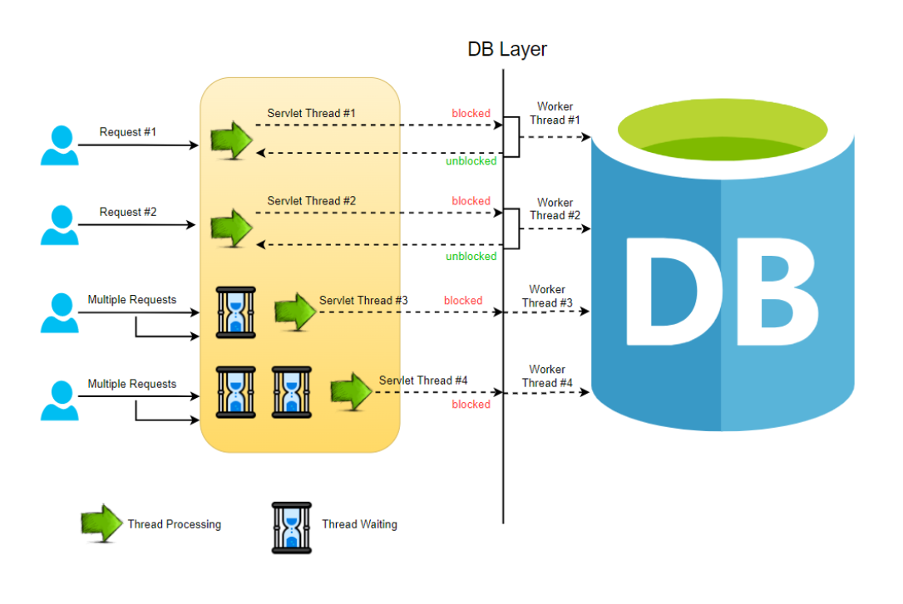
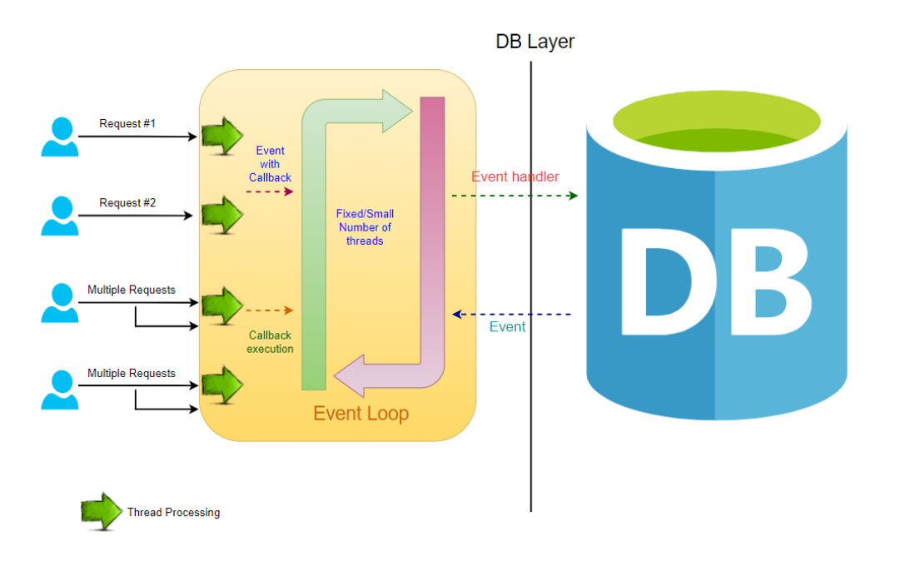

# What is Stream ?

A Stream is a sequence of data that is transferred from one system to another. It traditionally operates in a blocking, 
sequential, and FIFO (first-in-first-out) pattern.

<hr/>

Stream - bu bir tizimdan ikkinchisiga uzatiladigan ma'lumotlar ketma-ketligi. 

# Reactive Java Libraries

The reactive landscape in Java has evolved a lot in recent years. Before we move on further to understand the Spring 
Webflux component, let’s take a look into the reactive core libraries written in Java today. Here are the most popular 
ones:

`RxJava`: It is implemented out of the ReactorX project which hosts implementations for multiple programming languages 
and platforms. ReactiveX is a combination of the best ideas from the Observer pattern, the Iterator pattern, and 
functional programming.

`Project Reactor`: Reactor is a framework built by Pivotal and powered by Spring. It is considered as one of the 
foundations of the reactive stack in the Spring ecosystem. It implements Reactive API patterns which are based on the 
Reactive Streams specification.

`Akka Streams`: Although it implements the Reactive Streams implementation, the Akka Streams API is completely decoupled 
from the Reactive Streams interfaces. It uses Actors to deal with the streaming data. It is considered a 3rd generation 
Reactive library.

`Ratpack`: Ratpack is a set of Java libraries used for building scalable and high-performance HTTP applications. It uses 
Java 8, Netty, and reactive principles to provide a basic implementation of Reactive Stream API. You can also use 
Reactor or RxJava along with it.

`Vert.x`: Vert.x is a foundation project by Eclipse which delivers a polyglot event-driven framework for JVM. It is 
similar to Ratpack and allows to use RxJava or their native implementation for Reactive Streams API.

Spring Webflux is internally built using the core components of RxJava and RxNetty.

# Spring WebFlux

Spring WebFlux is a reactive web framework that is part of the Spring Framework. It provides support for building
reactive web applications using a non-blocking programming model. The reactive programming model is designed to handle
large volumes of concurrent requests by using asynchronous, non-blocking I/O operations instead of traditional blocking
I/O operations.

WebFlux provides two programming models: the annotated controller model and the functional endpoint model. The annotated
controller model is similar to the traditional Spring MVC programming model, while the functional endpoint model is a
new programming model that is optimized for reactive programming.

WebFlux also provides support for reactive data access using the Spring Data project. This allows you to use reactive
data access technologies like MongoDB Reactive Streams, Reactive Cassandra, and Reactive Redis.

Overall, Spring WebFlux is a powerful and flexible framework that enables developers to build highly scalable,
responsive, and resilient web applications using a reactive programming model.

They introduced the following features to keep in mind:

- `Responsive` : Reactive systems must be fast and responsive so that they can provide consistent high quality of 
service.
- `Resilient` : Reactive systems should be designed to anticipate system failures. Thus, they should be responsive 
through replication and isolation.
- `Elastic` : Reactive systems must be adaptive to shard or replicate components based upon their requirement. 
They should use predictive scaling to anticipate sudden ups and downs in their infrastructure.
- `Message-driven` : Since all the components in a reactive system are supposed to be loosely coupled, they must 
communicate across their boundaries by asynchronously exchanging messages.

<hr/>

Spring WebFlux - Bu Spring Frameworkning bir qismi bo'lgan Reactive web-framework. WebFlux bloklanmaydigan
dasturlash modelidan foydalangan holda Reactive web ilovalarni yaratishni qo'llab quvvatlaydi. Reactiev Dasturlash
modeli blokirovka qiluvchi I/O operatsiyalarni o'rniga asinxron, bloklanmaydigan I/O operatsiyalaridan foydalangan
holda bir vaqtning o'zida katta hajmdagi requestlarni bajarish uchun mo'ljallangan.

WebFlux 2ta dasturlash modelini taqdim etadi:

- Annotated Controller Model
- Functional Endpoint Model

Annotated Controller Modeli Spring MVC dasturlash modeliga o'xshaydi. Functional Endpoint Model esa Reactive dasturlash
uchun optimallashtirilgan yangi dasturlash modeli.

Umuman olganda, Spring WebFlux kuchli(powerful) va moslashuvchan(flexible) framework bo'lib, dasturchilarga Reactive
dasturlash modeldan foydalangan holda yuqori darajada kengaytiriladigan, sezgir va moslashuvchan web-ilovalarni
yaratishga imkon beradi.

Yodda tutushimiz kerak bo'lgan xususiyatlari:

- `Responsive` : Reactive dasturlar tezkor va sezgir bo'lishi kerak, shunda ular doim yuqori sifatli xizmat ko'rsatishi 
mumkin.
- `Resilient` : Reactive dasturlar tizimdagi nosozliklarni oldindan bilish uchun mo'ljallangan bo'lishi kerak. Shunday
qilib, ular replication va isolation orqali javob berishi kerak.
- `Elastic` : Reactive dasturlar ularning talablariga binoan qismlarga bo'linishi yoki takrorlanishiga moslashishi kerak
Ular o'zlarning infratuzilmasidan to'satdan ko'tarilishi va pasayishlarni boshqarish uchun masshtabdan foydalanishilari
kerak.
- `Message-driven` : Reactive dasturlar barcha componentlari bilan loose coupling yani erkin bog'langan bo'lishi kerakligi
sababli, ular o'z chegaralari bo'ylab asinxron xabar almashish orqali bog'lanishi kerak.


# Blocking Request

In a conventional MVC application, whenever a request reaches the server, a servlet thread is being created and 
delegated to worker threads to perform various operations like I/O, database processing, etc. While the worker threads 
are busy completing their processes, the servlet threads enter a waiting state due to which the calls remain blocked. This is blocking or synchronous request processing.



# Non-Blocking Request

In a non-blocking system, all the incoming requests are accompanied by an event handler and a callback. The request 
thread delegates the incoming request to a thread pool that manages a pretty small number of threads. Then the thread 
pool delegates the request to its handler function and gets available to process the next incoming requests from the 
request thread.

When the handler function completes its process, one of the threads from the pool fetches the response and passes it to 
the callback function. Thus the threads in a non-blocking system never go into the waiting state. This increases the 
productivity and the performance of the application.

A single request is potentially processed by multiple threads!



## Internally

Internally, Spring Reactive uses a combination of event loops and thread pools to manage the processing of asynchronous
requests. When a request comes in, it's handed off to an event loop, which runs on a single thread and processes the
request asynchronously. The event loop delegates the actual work to a thread pool, which executes the computations in
parallel.

Overall, Spring Reactive is designed to provide a highly efficient and scalable way of building reactive applications
that can handle large volumes of requests without blocking or slowing down. By leveraging the power of Reactive Streams
and Reactor, Spring Reactive makes it easy to build high-performance, non-blocking applications that can handle a wide
range of workloads.

<hr/>

Ichki Spring Reactive Asinxron requestlarni qayta ishlash uchun event loop va thread poollarning combinatsiyasidan
foydalanadi. Request kelganda Ushbu Request bitta threadda ishlaydigan va requestni asinxron tarzda qayta ishlovchi
event loopga uzatiladi. Event loop esa ishni parallel ravishda bajaruvchi thread poolga topshiradi.

# Publisher and Subscriber

Spring Reactive Publisher and Subscriber are two important concepts in reactive programming with Spring Framework.

A Spring Reactive Publisher is an object that emits a sequence of data items, also known as a stream, in a non-blocking,
asynchronous manner. It does so by implementing the Reactive Streams Publisher interface. This interface provides
methods for subscribing to the Publisher and for handling the data items emitted by the Publisher. Spring provides
various implementations of the Reactive Streams Publisher interface, such as Flux and Mono.

On the other hand, a Spring Reactive Subscriber is an object that receives the data emitted by a Publisher and processes
it in a non-blocking, asynchronous manner. It does so by implementing the Reactive Streams Subscriber interface. This
interface provides methods for receiving data items, handling errors, and indicating when the Subscriber is ready to
receive more data. Spring provides various implementations of the Reactive Streams Subscriber interface, such as
BaseSubscriber and LambdaSubscriber.

In a Spring reactive application, Publishers and Subscribers work together to create reactive streams of data that can
be processed in a non-blocking, asynchronous manner. Publishers emit data items and Subscribers receive and process
these items as they become available. This allows for efficient use of system resources and enables applications to
handle large amounts of data with minimal overhead.

# Producing a Stream of Data

In order for an application to be reactive, the first thing it must be able to do is to produce a stream of data.

This could be something like the stock update example that we gave earlier. Without this data, we wouldn't have anything
to react to, which is why this is a logical first step.

Reactive Core gives us two data types that enable us to do this.

## Flux

In Spring WebFlux, Flux is a reactive type that represents a stream of zero or more elements that are emitted over time.
It is part of the Reactor library, which is an essential component of Spring WebFlux.

Flux is an implementation of the Reactive Streams specification and provides a convenient API for working with reactive
streams. It is designed to work with asynchronous, non-blocking I/O operations and provides a powerful set of operators
for manipulating the stream of data.

For example, you can use the map operator to transform the elements in the stream, the filter operator to remove certain
elements from the stream, and the flatMap operator to merge multiple streams into one. These operators allow you to
create complex data processing pipelines that are highly efficient and flexible.

Using Flux in combination with Spring WebFlux allows you to build highly scalable and responsive web applications that
can handle a large number of concurrent requests.


```java
Flux<Integer> flux = Flux.just(1,2,3,4);

flux.subscribe(System.out::println);
```

output:

```java
1
2
3
4
```

## Mono

The second way of doing this is with a Mono, which is a stream of 0..1 elements. Mono is similar to Flux, but it is
optimized for use cases where you expect to receive only one element or an empty response. It is also designed to work
with asynchronous, non-blocking I/O operations.

Like Flux, Mono provides a set of operators that can be used to manipulate the data stream, including operators for
transforming data, filtering data, and handling errors.


```java
Mono<String> mono = Mono.just("Hello, World!");

mono.subscribe(System.out::println);
```