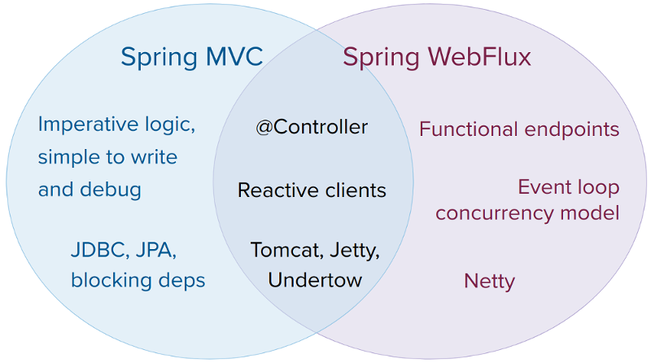
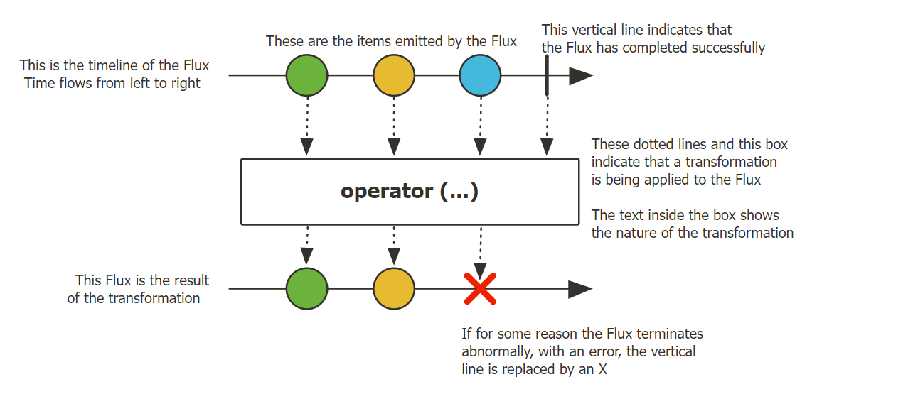
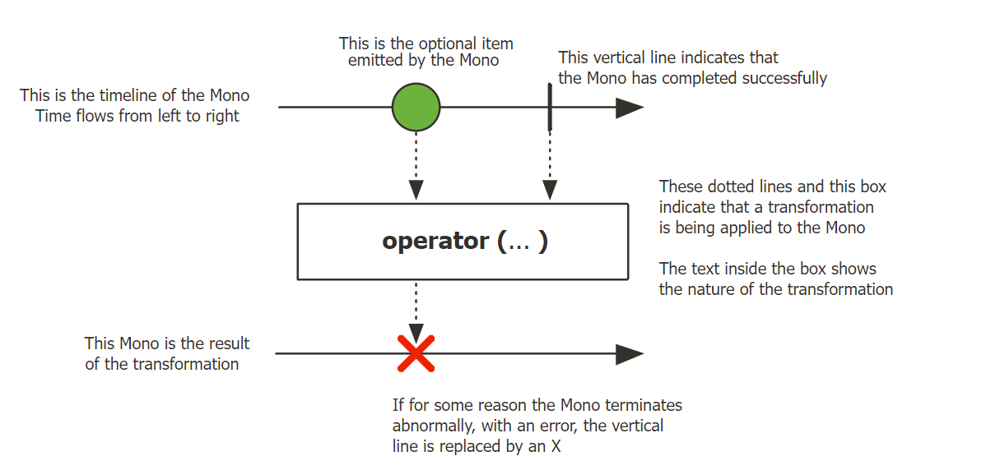

# Spring WebFlux

Spring WebFlux is a reactive web framework that is part of the Spring Framework. It provides support for building
reactive web applications using a non-blocking programming model. The reactive programming model is designed to handle
large volumes of concurrent requests by using asynchronous, non-blocking I/O operations instead of traditional blocking
I/O operations.

WebFlux provides two programming models: the annotated controller model and the functional endpoint model. The annotated
controller model is similar to the traditional Spring MVC programming model, while the functional endpoint model is a
new programming model that is optimized for reactive programming.

WebFlux also provides support for reactive data access using the Spring Data project. This allows you to use reactive
data access technologies like MongoDB Reactive Streams, Reactive Cassandra, and Reactive Redis.

Overall, Spring WebFlux is a powerful and flexible framework that enables developers to build highly scalable,
responsive, and resilient web applications using a reactive programming model.

<hr/>

Spring WebFlux - Bu Spring Frameworkning bir qismi bo'lgan Reactive web-framework. WebFlux bloklanmaydigan
dasturlash modelidan foydalangan holda Reactive web ilovalarni yaratishni qo'llab quvvatlaydi. Reactiev Dasturlash 
modeli blokirovka qiluvchi I/O operatsiyalarni o'rniga asinxron, bloklanmaydigan I/O operatsiyalaridan foydalangan 
holda bir vaqtning o'zida katta hajmdagi requestlarni bajarish uchun mo'ljallangan.

WebFlux 2ta dasturlash modelini taqdim etadi:
- Annotated Controller Model
- Functional Endpoint Model

Annotated Controller Modeli Spring MVC dasturlash modeliga o'xshaydi. Functional Endpoint Model esa Reactive dasturlash
uchun optimallashtirilgan yangi dasturlash modeli.

Umuman olganda, Spring WebFlux kuchli(powerful) va moslashuvchan(flexible) framework bo'lib, dasturchilarga Reactive
dasturlash modeldan foydalangan holda yuqori darajada kengaytiriladigan, sezgir va moslashuvchan web-ilovalarni 
yaratishga imkon beradi.



# Publisher and Subscriber

Spring Reactive Publisher and Subscriber are two important concepts in reactive programming with Spring Framework.

A Spring Reactive Publisher is an object that emits a sequence of data items, also known as a stream, in a non-blocking,
asynchronous manner. It does so by implementing the Reactive Streams Publisher interface. This interface provides
methods for subscribing to the Publisher and for handling the data items emitted by the Publisher. Spring provides
various implementations of the Reactive Streams Publisher interface, such as Flux and Mono.

On the other hand, a Spring Reactive Subscriber is an object that receives the data emitted by a Publisher and processes
it in a non-blocking, asynchronous manner. It does so by implementing the Reactive Streams Subscriber interface. This
interface provides methods for receiving data items, handling errors, and indicating when the Subscriber is ready to
receive more data. Spring provides various implementations of the Reactive Streams Subscriber interface, such as
BaseSubscriber and LambdaSubscriber.

In a Spring reactive application, Publishers and Subscribers work together to create reactive streams of data that can
be processed in a non-blocking, asynchronous manner. Publishers emit data items and Subscribers receive and process
these items as they become available. This allows for efficient use of system resources and enables applications to
handle large amounts of data with minimal overhead.

# Producing a Stream of Data

In order for an application to be reactive, the first thing it must be able to do is to produce a stream of data.

This could be something like the stock update example that we gave earlier. Without this data, we wouldn't have anything
to react to, which is why this is a logical first step.

Reactive Core gives us two data types that enable us to do this.

## Flux

In Spring WebFlux, Flux is a reactive type that represents a stream of zero or more elements that are emitted over time.
It is part of the Reactor library, which is an essential component of Spring WebFlux.

Flux is an implementation of the Reactive Streams specification and provides a convenient API for working with reactive
streams. It is designed to work with asynchronous, non-blocking I/O operations and provides a powerful set of operators
for manipulating the stream of data.

For example, you can use the map operator to transform the elements in the stream, the filter operator to remove certain
elements from the stream, and the flatMap operator to merge multiple streams into one. These operators allow you to
create complex data processing pipelines that are highly efficient and flexible.

Using Flux in combination with Spring WebFlux allows you to build highly scalable and responsive web applications that
can handle a large number of concurrent requests.



```java
Flux<Integer> flux = Flux.just(1,2,3,4);

flux.subscribe(System.out::println);
```

output:

```java
1
2
3
4
```

## Mono

The second way of doing this is with a Mono, which is a stream of 0..1 elements. Mono is similar to Flux, but it is
optimized for use cases where you expect to receive only one element or an empty response. It is also designed to work
with asynchronous, non-blocking I/O operations.

Like Flux, Mono provides a set of operators that can be used to manipulate the data stream, including operators for
transforming data, filtering data, and handling errors.



```java
Mono<String> mono = Mono.just("Hello, World!");

mono.subscribe(System.out::println);
```