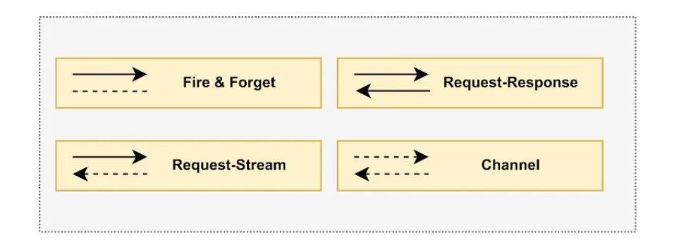

# RSocket

RSocket is an application protocol providing Reactive Streams semantics – it functions, for example, as an alternative
to HTTP.

---

RSocket - bu Reactive Stream semantikasini ta'minlovchi dastur protokoli. U masalan HTTP ga muqobil sifatida ishlaydi.

# Introduction to RSocket

HTTP is the most traditional and used way of communication between applications over networks. HTTP works on the
request-response model which involves sending a message and then waiting for a response. It doesn’t easily allow
asynchronous communication or allows for an open bidirectional channel for non-stop communication using the same
connection.

RSocket, a relatively new protocol over TCP for inter-application communication, allows asynchronous communication using
a reactive model consistent with reactive types like Flux and Mono. It is very important to know that with RSocket, we
do not use the terms like “client” and “server” because both sides become symmetrical and each side can initiate the
interaction. We refer to the participating sides as “requester” and “responder”.

## Communication Models

RSocket provides the following 4 distinct communication models:

- **Request-Response**: model mimics typical HTTP communication where the requester issues a single request and the
  responder responds with a single response. The only difference is that RSocket is fundamentally nonblocking and based
  on reactive types.
- **Request-Stream**: similar to request-response, except the responder responds with a stream of zero-to-many values in
  a stream.
- **Fire-and-Forget**: is used when the requester sends a request to the responder but doesn’t need a response. It is
  one-way communication.
- **Channel**: is a bidirectional communication channel where both the requester and responder can send data to each
  other at any time.



The type of communication channel is decided by the reactive types used in the methods. The following table should help
us understand how the model is applied:


# Spring boot dependency

```xml
<dependency>
    <groupId>org.springframework.boot</groupId>
    <artifactId>spring-boot-starter-rsocket</artifactId>
</dependency>
```

This will transitively pull in RSocket related dependencies such as _rsocket-core_ and _rsocket-transport-netty_.

# Message Handlers

Spring configuration will automatically detect @Controller beans with @MessageMapping annotation and use them as message
handlers. This is same for responder and requester side, both. We can compare them with @GetMapping and @PostMapping for
easy understanding.

---

Spring konfiguratsiyasi `@MessageMapping` anntatsiyasi bilan `@Controller` beanlarni avtomatik aniqlaydi va message
handler sifatida ishlatiladi. Bu responder va requester uchun bir xil. `@PostMapping` va `@GetMapping` annotatsiyalari
bilan solishtirishimiz mumkin. 

```java
@Controller
public class AppController {

    @MessageMapping("mapped-path")
    public Flux<ResponseType> handle(Mono<RequestType> request) {
        // ...
    }
}
```

`@DestinationVariable` `@PathVariable` ga o'xshaydi pathlarda dynamic qiymatlarni olish uchun ishlatiladi.

```java
@MessageMapping("operation/{name}")
public Mono<String> operate(@DestinationVariable("name") String name) {
	...
}
```

