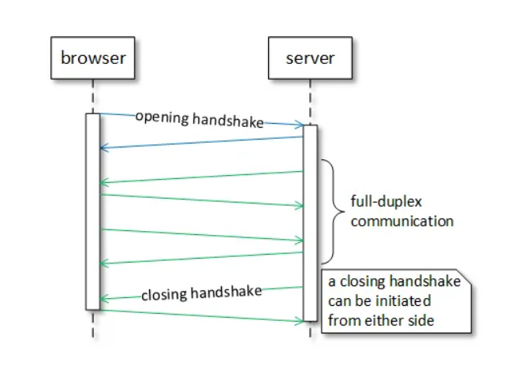
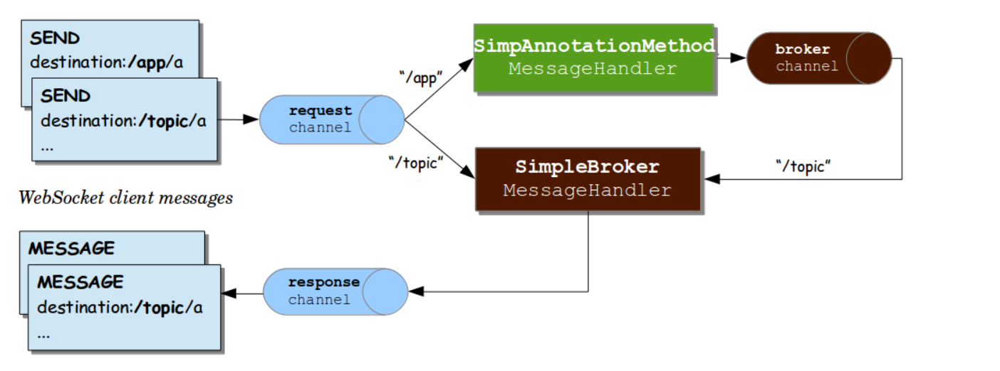

# WebSocket

## HTTP request

Http Protocoli request-response protocolidir. Bu shuni anglatadiki, faqat mijoz HTTP requestlarini serverga yuborishi
mumkin. Server faqat HTTP requestlariga HTTP responselarni yuborish orqali xizmat ko'rsatishi mumkin, ammo server 
mijozga so'ralmagan responselarni yubora olmaydi.

## HTTP Streaming

Stream mexanizmi vaqtida mijoz serverga request yuboradi va uni cheksiz muddatga ochiq saqlaydi. Yangi ma'lumotlar 
kelmaguncha server javob bermaydi. Yangi ma'lumotlar mavjud bo'lganda, server javobning bir qismi sifatida uni mijozga
qaytarib yuboradi.

## SSE (Server-Sent Events)

Server-Sent Events (SSE) tarmoq protocoli va brauzerlar uchun EventSource API ga ega bo'lgan standartlashtirilgan oqim
mexanizmi. SSE serverdan brauzerga bir yo'nalishli UTF-8 kodlangan eventlar oqimni belgilaydi.

## WebSocket

WebSocket - bu bitta TCP ulanishi orqali mijozlar (asosan brauzerlar) va serverlar o'rtasida text va binary xabarlarni
bir vaqtning o'zida ikki tomonlama uzatish imkonini beruvchi protocol. WebSocket 80-portda ("ws" schemasi) TCP orqali
yoki 443-portda ("wss" schemasi) TLS/TCP orqali muloqot qilishi mumkin.



WebSocket protocoli bitta TCP ulanishi orqali mijoz va server o'rtasida to'liq dupleks yani Full-Deplex ikki tomonlama
aloqa kanalini o'rnatishning standardlashtirilgan usulni taqdim etadi. Full-Duplex aloqada ikkala tomon bir vaqtning
o'zida ikkala yo'nalishda ham xabarlarni yuborishi va qabul qilishi mumkin. Half-Duplex aloqada ikkala tomon ham har 
ikki yo'nalishda ham xabarlarni yuborishi va qabul qilishi mumkin, lekin bir vaqtning o'zida emas.

Qisqa qilib aytganda WebSocket ikki tomonlama client va server o'rtasidagi aloqani ta'minlash uchun ishlatiladi.

HTTP text protocol, WebSocket binary protocol (binary protocollar text protocollarga qaraganda tarmoq orqali kamroq
ma'lumotlarni uzatadi)

WebSocket brauzer-server aloqasiga iloji boricha kamroq o'zgarishlar kiritgan holda TCP socketlarini qo'llab quvvatlash
uchun mo'ljallangan, bu esa Internetning zarur xavfsizlik cheklovlarini ta'minlaydi. WebSocket TCP ning ustiga faqat 
minimal funksionallikni qo'shadi, faqat quyidagilardan boshqa narsa emas:

- origin-based security model
- binary protocoli ustidagi text protocol
- yopiq handshake

## Opening handshake

xabar almashinuvini boshlashdan oldin, client va server o'rtasida ulanishni o'rnatish kerak. 

An example of an HTTP to WebSocket upgrade request:

```yaml
GET /spring-websocket-portfolio/portfolio HTTP/1.1
Host: localhost:8080
Upgrade: websocket
Connection: Upgrade
Sec-WebSocket-Key: Uc9l9TMkWGbHFD2qnFHltg==
Sec-WebSocket-Protocol: v10.stomp, v11.stomp
Sec-WebSocket-Version: 13
Origin: http://localhost:8080
```

## When to use WebSocket

WebSocket web sahifani dinamik va interaktiv qilishi mumkin.

## Dependencies

```xml
<dependency>
    <groupId>org.springframework.boot</groupId>
    <artifactId>spring-boot-starter-websocket</artifactId>
</dependency>

<dependency>
    <groupId>org.springframework</groupId>
    <artifactId>spring-messaging</artifactId>
</dependency>
```

## Enable WebSocket in Spring

Birinchidan, Biz WebSocket imkoniyatlarini yoqamiz. Buni amalga oshirish uchun biz configuratsiya classni qo'shishimiz 
kerak bo'ladi va ushbu classga `@EnableWebSocketMessageBroker` annotatsiyasini qo'yishimiz ham kerak.

```java
@Configuration
@EnableWebSocketMessageBroker
public class WebSocketConfig extends AbstractWebSocketMessageBrokerConfigurer {

    @Override
    public void configureMessageBroker(MessageBrokerRegistry config) {
        config.enableSimpleBroker("/topic");
        config.setApplicationDestinationPrefixes("/app");
    }

    @Override
    public void registerStompEndpoints(StompEndpointRegistry registry) {
         registry.addEndpoint("/chat");
         registry.addEndpoint("/chat").withSockJS();
    }
}
```

## STOMP

WebSocket ikki xil turdagi xabar almashish turlarni belgilaydi. Text va Binary, lekin ularning content aniqlanmagan.
Mijoz va Server uchun WebSocket tepasida qanday xabarlarni yuborishi mumkinligini, formati, mazmunini aniqlash uchun 
sub-protocol (ya'ni yuqori darajadagi xabar almashish protocoli) bo'yicha muzokaralar olib borish mexanizmni belgilaydi. Ya'ni yuqori darajadagi
xabar almashish protocoli.

STOMP oddiy matnga yo'naltirilgan(text-oriented) messaging protocol bo'lib, dastlab Ruby, Python va Perl kabi script
tillarda uchun korporativ brokerlarga ulanish uchun yaratilgan. STOMP TCP va WebSocket kabi har qanday ishonchli
ikki tomonlama tarmoq protocoli orqali ishlatilishi mumkin. STOMP text yo'naltirilgan protocol bo'lsada, xabarlarning
text yoki binary bo'lishi mumkin.

STOMP - bu framelarga asoslangan protocol bo'lib, uning framelari HTTP da modellashtirilgan.
The structure of a STOMP frame:

---

STOMP is a simple text-oriented messaging protocol that was originally created for scripting languages such as Ruby, 
Python, and Perl to connect to enterprise message brokers. It is designed to address a subset of commonly used messaging
patterns. STOMP can be used over any reliable 2-way streaming network protocol such as TCP and WebSocket. Although STOMP
is a text-oriented protocol, the payload of messages can be either text or binary.

STOMP is a frame based protocol whose frames are modeled on HTTP. The structure of a STOMP frame:

```
COMMAND
header1:value1
header2:value2

Body^@
```

Mijozlar xabar yuborish yoki ularga obuna bo'lish uchun SEND yoki SUBCRIBE buyruqlaridan hamda nima haqida ekanligini
va uni kim olishi kerakligini tavsiflovchi "destination" sarlavhasidan foydalanishlari mumkin. Bu broker orqali
boshqa ulangan mijozlarga xabar yuborish yoki ba'zi ishlarni bajarishni so'rash uchun serverga xabarlar yuborish uchun
ishlatilishi mumkin bo'lgan oddiy pub-sub mexanizmni ta'minlaydi.

Spring ning STOMP qo'llab quvvatlashidan foydalanganda, Spring WebSocket ilovasi mijozlar uchun STOMP brokeri sifatida
ishlaydi. `@Controller` classidagi xabar handle qilish yani (message-handling) methodlariga yoki subscribelar handle
qilish methodlarni kuzatib boradigan va obuna bo'lgan foydalanuvchilarga xabarlarni uzatadigan oddiy, xotiradagi broker
yo'naltiradi.

Shuningdek, siz Spring-ning maxsus STOMP brokeri (masalan, ActiveMQ, RabbitMQ va boshqalar) bilan ishlash uchun 
sozlashingiz mumkin. Bunday holda, Spring brokeri TCP ulanishlarni saqlaydi, unga xabarlarni uzatadi va undan xabarlarni
olish uchun ulangan WebSocket clientlariga uzatadi.

---

Clients can use the SEND or SUBSCRIBE commands to send or subscribe for messages along with a "destination" header that
describes what the message is about and who should receive it. This enables a simple publish-subscribe mechanism that 
can be used to send messages through the broker to other connected clients or to send messages to the server to request
that some work be performed.

When using Spring’s STOMP support, the Spring WebSocket application acts as the STOMP broker to clients. Messages are 
routed to @Controller message-handling methods or to a simple, in-memory broker that keeps track of subscriptions and 
broadcasts messages to subscribed users. You can also configure Spring to work with a dedicated STOMP broker (e.g. 
RabbitMQ, ActiveMQ, etc) for the actual broadcasting of messages. In that case Spring maintains TCP connections to the
broker, relays messages to it, and also passes messages from it down to connected WebSocket clients. Thus Spring web 
applications can rely on unified HTTP-based security, common validation, and a familiar programming model 
message-handling work.

## Flow of Messages



* `clientInboundChannel` — WebSocket mijozlaridan olingan xabarlarni uzatish uchun.
* `clientOutboundChannel` — WebSocket mijozlariga server xabarlarini yuborish uchun.
* `brokerChannel` — server tomonidan xabarlar brokeriga xabarlarni yuborish uchun, ilova kodi.

## Dot As Separator

When messages are routed to @MessageMapping methods, they’re matched with AntPathMatcher and by default patterns are 
expected to use slash "/" as separator. This is a good convention in a web applications and similar to HTTP URLs. 
However if you are more used to messaging conventions, you can switch to using dot "." as separator.

Configuration

```java
@Configuration
@EnableWebSocketMessageBroker
public class WebSocketConfig implements WebSocketMessageBrokerConfigurer {

    // ...

    @Override
    public void configureMessageBroker(MessageBrokerRegistry registry) {
        registry.setPathMatcher(new AntPathMatcher("."));
        registry.enableStompBrokerRelay("/queue", "/topic");
        registry.setApplicationDestinationPrefixes("/app");
    }
}
```

Using Example:

```java
@Controller
@MessageMapping("foo")
public class FooController {

    @MessageMapping("bar.{baz}")
    public void handleBaz(@DestinationVariable String baz) {
        // ...
    }
}
```
